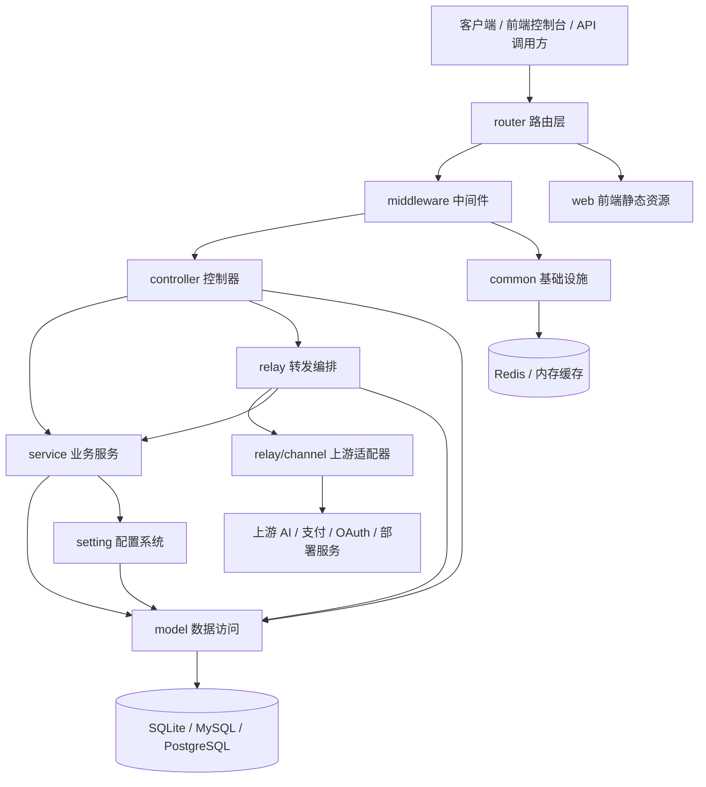
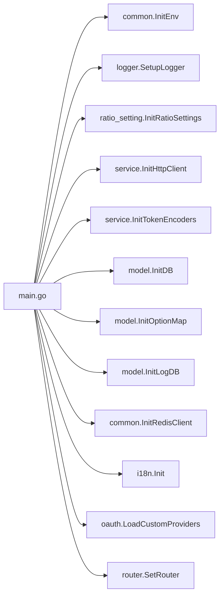
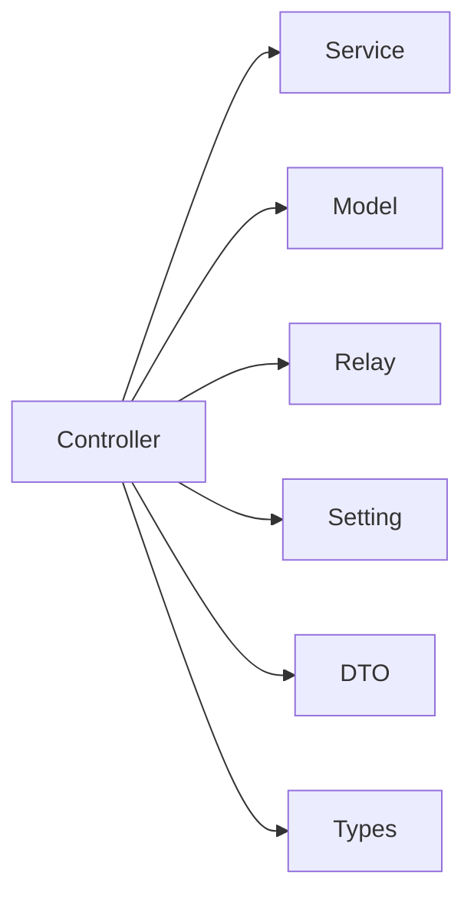
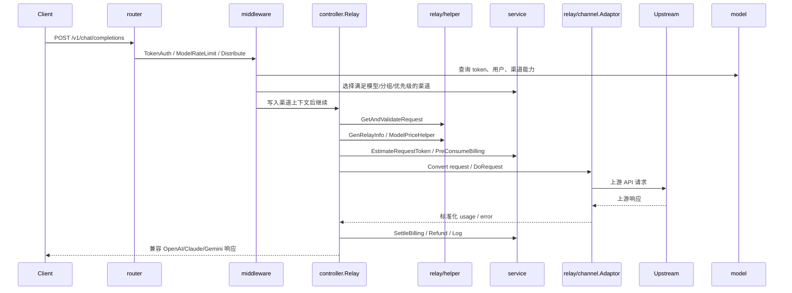
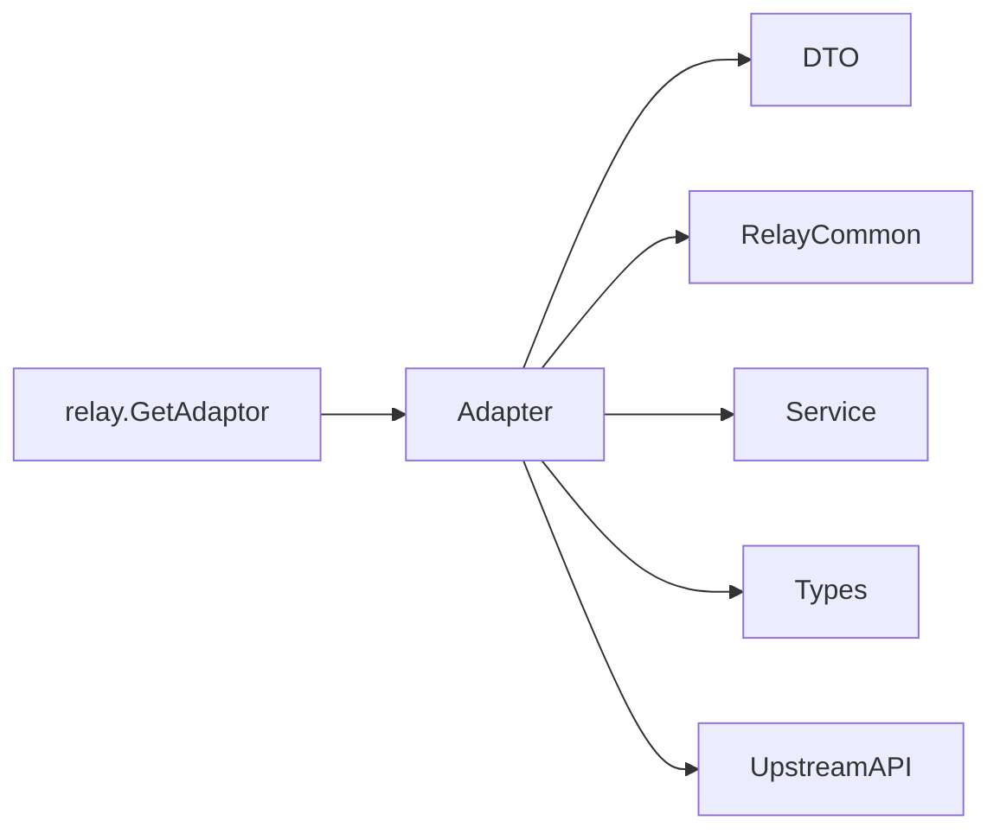
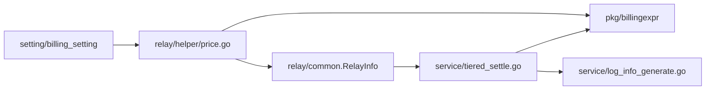
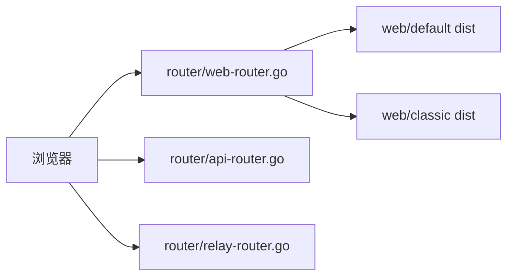
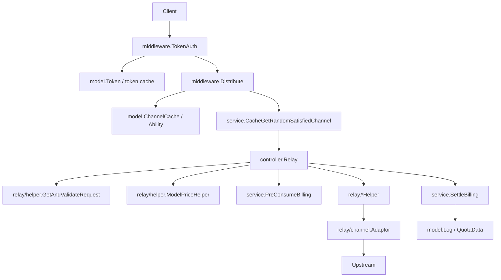
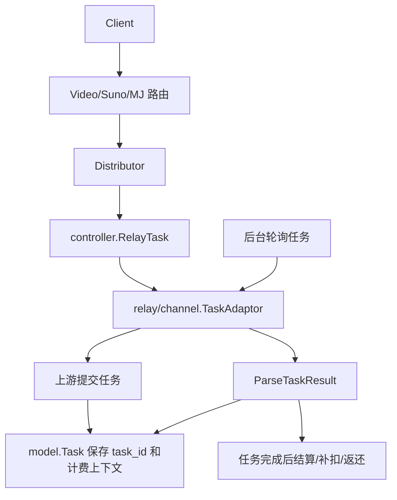

# 项目模块关系

本文基于当前源码目录、入口文件、路由注册、核心接口和主要业务文件整理，目标是帮助开发者快速理解项目的模块边界、调用关系和依赖方向。

## 1. 总体定位

本项目是一个 AI API 网关/代理系统，后端使用 Go + Gin + GORM，前端包含新版 `web/default` 和旧版 `web/classic` 两套 React 控制台。系统向下游暴露 OpenAI、Claude、Gemini、Midjourney、Suno、视频生成等兼容接口，并把请求路由到 40+ 上游渠道；同时提供用户、令牌、渠道、计费、订阅、充值、日志、监控、OAuth、WebAuthn/Passkey、后台管理等能力。

整体架构可以概括为：



## 2. 启动与运行时初始化

入口文件是 `main.go`。

启动阶段主要流程：

1. `InitResources()` 加载 `.env`、初始化环境变量、日志、模型倍率配置、HTTP 客户端、tokenizer、数据库、配置项、价格表、日志数据库、Redis、性能指标、系统监控、i18n、自定义 OAuth Provider。
2. 启动后台任务：渠道缓存同步、配置热更新、额度数据看板刷新、渠道自动更新、渠道自动测试、Codex 凭证刷新、订阅额度重置、任务轮询、渠道上游模型更新、Midjourney/视频任务更新等。
3. 创建 Gin 实例，安装恢复、请求 ID、PoweredBy、i18n、日志、Session 等全局中间件。
4. 注入 Umami / Google Analytics 到内嵌前端 HTML。
5. 调用 `router.SetRouter()` 注册 API、Dashboard、Relay、Video、Web 路由。
6. 监听 `PORT`，默认使用 `common.Port`。

启动依赖关系：



## 3. 顶层目录模块

| 模块 | 主要功能 | 典型依赖 | 被谁依赖 |
| --- | --- | --- | --- |
| `main.go` | 应用启动、资源初始化、后台任务、Gin Server | `common`、`model`、`service`、`router`、`controller`、`relay`、`setting` | 进程入口 |
| `router/` | 路由注册，划分 `/api`、`/v1`、`/mj`、`/suno`、`/kling`、Web 静态资源等 | `controller`、`middleware`、`relay`、`common` | `main.go` |
| `middleware/` | 鉴权、渠道分发、限流、CORS、请求体复用、日志、性能保护、请求转换 | `common`、`constant`、`model`、`service`、`setting`、`dto`、`i18n` | `router`、请求链路 |
| `controller/` | HTTP handler，负责参数绑定、权限边界、响应格式、调用服务 | `service`、`model`、`relay`、`setting`、`dto`、`types` | `router` |
| `service/` | 业务逻辑：渠道选择、计费、订阅、支付、任务、OAuth、敏感词、文件、通知、token 估算 | `model`、`setting`、`common`、`dto`、`types`、`relay/common` | `controller`、`middleware`、`relay` |
| `model/` | GORM 模型、迁移、CRUD、缓存、额度/日志/任务/订阅等数据操作 | `common`、`constant`、`dto` | `service`、`controller`、`middleware`、`setting` |
| `relay/` | AI 请求转发编排、请求校验、价格计算、上游适配器选择、响应处理 | `relay/channel`、`relay/common`、`relay/helper`、`service`、`model`、`dto` | `controller` |
| `relay/channel/` | 具体上游 Provider 适配器，负责 URL、Header、请求/响应转换 | `dto`、`relay/common`、`service`、`types`、`common` | `relay` |
| `dto/` | 请求/响应结构体，覆盖 OpenAI、Claude、Gemini、音频、图片、视频、任务等格式 | `types`、`constant` | `controller`、`relay`、`service`、`model` |
| `types/` | 跨层通用类型：错误、价格、文件、RelayFormat、并发 Map/Set | 少量基础包 | 多数模块 |
| `constant/` | 全局枚举和常量：渠道类型、API 类型、上下文 key、任务类型、状态等 | 无或少量基础包 | 多数模块 |
| `common/` | 基础设施：JSON 包装、环境变量、Redis、缓存、加密、邮件、请求体存储、SSRF 防护、日志工具 | 第三方库、标准库 | 多数模块 |
| `setting/` | 运行时配置注册、DB 配置加载、模型倍率、计费、系统/运营/性能配置 | `common`、`setting/config` | `main`、`service`、`relay`、`controller` |
| `i18n/` | 后端国际化，加载 YAML 语言包，按用户语言翻译错误消息 | `model` 通过 loader 间接提供语言 | `middleware`、`controller`、`service` |
| `logger/` | 请求日志、系统日志、额度格式化、错误/消费日志辅助 | `common`、`model` | `controller`、`service`、`relay`、`middleware` |
| `oauth/` | OAuth Provider 注册和实现，包括 GitHub、Discord、OIDC、LinuxDO、自定义 Provider | `model`、`setting`、`common` | `controller/oauth`、`main` |
| `pkg/billingexpr/` | 表达式计费引擎：编译、运行、结算、舍入、表达式文档 | `expr-lang`、标准库 | `relay/helper`、`service`、`setting/billing_setting` |
| `pkg/cachex/` | 泛型/混合缓存封装，支持命名空间和 codec | `common`、Redis | 业务缓存扩展点 |
| `pkg/ionet/` | io.net 部署/容器/硬件 API 客户端 | 外部 HTTP | `controller/deployment`、`service` |
| `pkg/perf_metrics/` | Relay 性能指标采样、聚合、落库/清理 | `model`、`setting` | `main`、`controller`、`relay` |
| `web/default/` | 新版 React 19 控制台，Rsbuild、TanStack Router、React Query、Base UI、Tailwind | 后端 `/api` | 用户浏览器、`router/web` |
| `web/classic/` | 旧版 React 18 控制台，Vite、Semi UI | 后端 `/api` | 用户浏览器、`router/web` |
| `docs/` | 安装、渠道、OpenAPI、翻译术语等文档 | 无 | 开发者/用户 |
| `electron/` | 桌面托盘包装相关脚本和资源 | Node/Electron | 独立打包 |
| `bin/` | 旧版本 SQL 迁移脚本、测试脚本 | 数据库 | 运维/升级 |

## 4. 路由层

`router.SetRouter()` 聚合四类路由：

| 文件 | 路由范围 | 功能 |
| --- | --- | --- |
| `router/api-router.go` | `/api/**` | 控制台 REST API：用户、令牌、渠道、配置、价格、订阅、充值、日志、OAuth、Passkey、排行榜、性能、部署等 |
| `router/relay-router.go` | `/v1/**`、`/mj/**`、`/suno/**`、`/v1beta/**` | AI 兼容 API：OpenAI、Claude、Gemini、Realtime、Midjourney、Suno、Embedding、Audio、Image、Rerank 等 |
| `router/video-router.go` | `/v1/video/**`、`/v1/videos/**`、`/kling/v1/**`、`/jimeng` | 视频生成、视频查询、视频内容代理、Kling/Jimeng 请求转换 |
| `router/dashboard.go` | `/dashboard/billing/**`、`/v1/dashboard/billing/**` | 兼容旧 Dashboard Billing API |
| `router/web-router.go` | 静态文件和 SPA fallback | 根据主题提供 `web/default/dist` 或 `web/classic/dist`，也支持外部 `FRONTEND_BASE_URL` |

路由层只做分组和中间件组合，不承载复杂业务。

## 5. 中间件层

中间件负责在进入 controller 前建立请求上下文。

核心中间件：

| 文件 | 功能 |
| --- | --- |
| `auth.go` | 用户登录态、API Token、Root/Admin/User 权限、TokenOrUser 认证 |
| `distributor.go` | Relay 渠道分发：解析请求模型、检查 token 模型限制、处理 auto 分组、渠道亲和、随机选择满足条件的渠道，并把渠道元信息写入 Gin Context |
| `rate-limit.go`、`model-rate-limit.go`、`email-verification-rate-limit.go` | 全局、模型、关键操作、邮件相关限流 |
| `body_cleanup.go` | 请求体复用和清理，支撑校验、分发、重试多次读取 body |
| `cors.go`、`gzip.go`、`disable-cache.go`、`cache.go` | HTTP 基础能力 |
| `logger.go`、`request-id.go`、`stats.go`、`performance.go` | 日志、请求 ID、统计、系统性能保护 |
| `i18n.go` | 根据请求/用户设置语言 |
| `kling_adapter.go`、`jimeng_adapter.go` | 将特定官方 API 请求转换成内部任务格式 |
| `secure_verification.go`、`turnstile-check.go` | 高风险操作验证、人机验证 |
| `header_nav.go` | 前端导航模块可见性/访问控制 |

`Distribute()` 是 Relay 请求的关键入口：它依赖 `model` 的渠道能力缓存、`service` 的渠道选择和亲和策略、`setting` 的 auto 分组配置，最后写入 `ContextKeyChannelId`、`ContextKeyChannelType`、`ContextKeyChannelKey`、`ContextKeyOriginalModel` 等上下文信息。

## 6. Controller 层

`controller/` 是 HTTP API 的适配层，文件基本按业务域拆分。

主要业务域：

| 文件/文件组 | 功能 |
| --- | --- |
| `relay.go` | Relay 总控制器：校验请求、生成 `RelayInfo`、敏感词检测、token 估算、价格计算、预扣费、调用 `relay`、失败重试、错误响应 |
| `channel.go`、`channel-test.go`、`channel-billing.go`、`channel_upstream_update.go` | 渠道 CRUD、模型拉取、余额查询、渠道测试、批量操作、上游模型更新 |
| `user.go`、`token.go`、`group.go` | 用户、API token、分组、用户自助信息 |
| `topup*.go`、`subscription*.go`、`billing.go`、`payment_*.go` | 充值、支付回调、订阅计划、订阅订单、余额/订阅计费 |
| `log.go`、`usedata.go`、`rankings.go` | 消费日志、用量统计、排行榜 |
| `model.go`、`model_meta.go`、`vendor_meta.go`、`pricing.go`、`ratio_*` | 模型列表、模型元数据、供应商元数据、价格展示、倍率同步 |
| `oauth.go`、`custom_oauth.go`、`github.go`、`discord.go`、`oidc.go`、`linuxdo.go`、`wechat.go`、`telegram.go` | 第三方登录和绑定 |
| `passkey.go`、`twofa.go`、`secure_verification.go` | Passkey、双因素认证、安全验证 |
| `task.go`、`task_video.go`、`midjourney.go`、`video_proxy*.go` | 异步任务、Midjourney、视频任务轮询和内容代理 |
| `performance.go`、`perf_metrics.go`、`uptime_kuma.go` | 性能状态、Relay 性能指标、外部健康检查 |
| `deployment.go` | io.net 部署管理 |
| `option.go`、`console_migrate.go`、`setup.go`、`misc.go` | 系统配置、初始化、公告/关于/协议等公共信息 |

Controller 的依赖方向通常是：



其中管理类 API 多数调用 `model`/`service` 后直接返回 JSON；Relay 类 API 会进入 `relay` 子系统。

## 7. Service 层

`service/` 承载跨 controller/relay 复用的业务逻辑。

| 文件/文件组 | 功能 |
| --- | --- |
| `channel_select.go`、`channel.go`、`channel_affinity.go` | 渠道随机选择、auto 分组、优先级/权重、渠道亲和缓存和统计 |
| `billing.go`、`billing_session.go`、`pre_consume_quota.go`、`quota.go`、`tiered_settle.go`、`text_quota.go`、`task_billing.go`、`tool_billing.go`、`violation_fee.go` | 预扣费、后结算、钱包/订阅计费、阶梯表达式结算、任务计费、工具计费、违规费用 |
| `token_counter.go`、`token_estimator.go`、`tokenizer.go` | token 估算和 tokenizer 初始化 |
| `sensitive.go`、`str.go` | 敏感词 AC 自动机和文本检查 |
| `task.go`、`task_polling.go`、`subscription_reset_task.go` | 异步任务提交/轮询、订阅额度周期重置 |
| `midjourney.go`、`audio.go`、`image.go`、`file_service.go`、`file_decoder.go`、`download.go` | 媒体、文件下载、图片/音频处理 |
| `http.go`、`http_client.go` | 全局 HTTP 客户端、代理、超时和传输配置 |
| `codex_oauth.go`、`codex_credential_refresh*.go`、`codex_wham_usage.go` | Codex 渠道 OAuth 和凭证刷新 |
| `openai_chat_responses_*`、`openaicompat/` | OpenAI Chat/Responses 兼容转换 |
| `epay.go`、`waffo_pancake.go`、`webhook.go`、`funding_source.go`、`return_path.go` | 支付、Webhook、资金来源、支付返回地址 |
| `passkey/` | WebAuthn/Passkey 服务封装 |
| `rankings.go`、`user_notify.go`、`notify-limit.go`、`log_info_generate.go` | 排行榜、通知、日志附加信息 |

Service 依赖 `model` 做持久化，依赖 `setting` 获取运行时配置，依赖 `relay/common` 中的 `RelayInfo` 完成 Relay 计费上下文。

## 8. Model 层与数据模型

`model/` 负责 GORM 数据模型、数据库迁移和数据操作，兼容 SQLite、MySQL、PostgreSQL。

主要实体：

| 文件 | 实体/功能 |
| --- | --- |
| `main.go` | DB/LOG_DB 初始化、迁移、三种数据库兼容、列名/布尔值差异处理 |
| `user.go`、`user_cache.go` | 用户、角色、状态、额度、缓存、用户设置 |
| `token.go`、`token_cache.go` | API token、模型限制、额度、token key 缓存 |
| `channel.go`、`channel_cache.go`、`channel_satisfy.go`、`ability.go` | 渠道、渠道信息、多 key、能力表、分组/模型可用性、缓存选择 |
| `log.go`、`usedata.go`、`usedata_rankings.go` | 操作日志、消费日志、日用量聚合、排行榜数据 |
| `pricing.go`、`pricing_default.go`、`pricing_refresh.go` | 模型价格、供应商、端点类型、价格刷新 |
| `subscription.go`、`topup.go`、`redemption.go` | 订阅计划、订阅订单、用户订阅、充值、兑换码 |
| `task.go`、`midjourney.go` | 通用异步任务和 Midjourney 任务 |
| `model_meta.go`、`vendor_meta.go`、`model_extra.go`、`missing_models.go` | 模型/供应商元数据、启用分组、缺失模型 |
| `option.go`、`setup.go` | 系统配置项和初始化状态 |
| `custom_oauth_provider.go`、`user_oauth_binding.go` | 自定义 OAuth Provider 和用户绑定 |
| `passkey.go`、`twofa.go`、`checkin.go` | Passkey、2FA、签到 |
| `perf_metric.go` | Relay 性能指标 |
| `prefill_group.go` | 预填分组配置 |

Model 层对上层暴露 CRUD/查询函数，例如 `GetRandomSatisfiedChannel()`、`GetTokenByKey()`、`DecreaseUserQuota()`、`RecordConsumeLog()`、`PreConsumeUserSubscription()`。上层不应绕过 model 直接写数据库。

## 9. Relay 子系统

Relay 是本项目最核心的请求代理模块，处理“下游兼容格式 -> 内部统一上下文 -> 上游 Provider 格式 -> 下游兼容响应”的全过程。

### 9.1 Relay 请求主流程



### 9.2 Relay 内部模块

| 模块 | 功能 |
| --- | --- |
| `relay_adaptor.go` | 根据 `constant.APIType*` 或任务平台返回具体适配器 |
| `compatible_handler.go` | OpenAI Chat/Completion 文本转发 |
| `responses_handler.go` | OpenAI Responses API 转发 |
| `claude_handler.go` | Claude Messages API 转发 |
| `gemini_handler.go` | Gemini 原生/兼容转发 |
| `embedding_handler.go`、`audio_handler.go`、`image_handler.go`、`rerank_handler.go`、`websocket.go` | 各 endpoint 类型处理 |
| `relay_task.go` | 异步任务提交和查询 |
| `mjproxy_handler.go` | Midjourney 图片代理 |
| `relay/common/` | `RelayInfo`、渠道元信息、请求转换链、出站 body、流状态、覆盖参数 |
| `relay/helper/` | 请求校验、模型映射、价格计算、流扫描、表达式计费请求上下文 |
| `relay/common_handler/` | 复用响应处理，如 rerank |
| `relay/reasonmap/` | finish reason / reasoning 相关映射 |

### 9.3 Provider 适配器

`relay/channel/adapter.go` 定义两个核心接口：

| 接口 | 用途 |
| --- | --- |
| `Adaptor` | 同步/流式 AI API 适配器，负责初始化、URL、Header、请求转换、发送请求、响应转换、模型列表 |
| `TaskAdaptor` | 异步任务适配器，负责校验请求、构造请求、提交任务、解析结果、任务轮询、任务计费调整 |

当前同步 Provider 目录包括：

`ai360`、`ali`、`aws`、`baidu`、`baidu_v2`、`claude`、`cloudflare`、`codex`、`cohere`、`coze`、`deepseek`、`dify`、`gemini`、`jimeng`、`jina`、`lingyiwanwu`、`minimax`、`mistral`、`mokaai`、`moonshot`、`ollama`、`openai`、`openrouter`、`palm`、`perplexity`、`replicate`、`siliconflow`、`submodel`、`tencent`、`vertex`、`volcengine`、`xai`、`xinference`、`xunfei`、`zhipu`、`zhipu_4v`。

异步任务 Provider 在 `relay/channel/task/`：

`ali`、`doubao`、`gemini`、`hailuo`、`jimeng`、`kling`、`sora`、`suno`、`vertex`、`vidu`，公共逻辑在 `taskcommon`。

适配器依赖方向：



## 10. DTO、Types、Constant

这三个模块是跨层契约。

| 模块 | 作用 |
| --- | --- |
| `dto/` | 外部 API 和内部 controller/service 间传递的数据结构，包括 OpenAI、Claude、Gemini、Realtime、Audio、Image、Video、Task、Pricing、UserSetting 等 |
| `types/` | 跨层通用类型，如 `RelayFormat`、`NewAPIError`、`PriceData`、`FileSource`、`RequestMeta`、线程安全 Map/Set |
| `constant/` | 枚举和常量，如渠道类型、API 类型、任务平台、上下文 key、finish reason、endpoint type、缓存 key、环境变量名 |

依赖原则：业务模块依赖这些稳定契约；这些契约模块应尽量避免反向依赖业务层。

## 11. 配置系统

`setting/` 把分散配置收敛到可注册、可从 DB 加载的配置管理器。

核心是 `setting/config.ConfigManager`：

1. 各配置包在 `init()` 中调用 `config.GlobalConfig.Register(name, &configStruct)`。
2. `model.InitOptionMap()` 从 `options` 表加载配置。
3. `GlobalConfig.LoadFromDB()` 按 `配置名.字段名` 更新结构体。
4. `model.SyncOptions()` 周期热更新。

配置分组：

| 目录 | 功能 |
| --- | --- |
| `billing_setting/` | 阶梯/表达式计费模式和表达式 |
| `console_setting/` | 控制台显示配置 |
| `model_setting/` | 模型族配置，如 Claude、Gemini、Qwen、Grok、全局参数 |
| `operation_setting/` | 运营配置：支付、签到、限额、敏感词、用户可用组、渠道亲和、工具价格 |
| `perf_metrics_setting/` | Relay 性能指标开关和保留策略 |
| `performance_setting/` | 系统性能、防护和缓存相关配置 |
| `ratio_setting/` | 模型倍率、分组倍率、暴露倍率、后缀匹配、缓存倍率 |
| `reasoning/` | reasoning 相关配置 |
| `system_setting/` | 主题、OIDC、Discord、Passkey、法律文本、远程 fetch |

## 12. 计费系统

计费贯穿 `relay/helper`、`service`、`model` 和 `pkg/billingexpr`。

主要阶段：

1. `relay/helper.ModelPriceHelper()` 根据模型、分组、价格配置、表达式计费配置计算预扣额度。
2. `service.PreConsumeBilling()` 创建 `BillingSession`，从钱包或订阅中预扣。
3. 上游响应返回 usage 后，文本/音频/图片/任务处理逻辑计算实际额度。
4. `service.SettleBilling()` 根据实际额度补扣或返还。
5. `model.RecordConsumeLog()` / `model.RecordTaskBillingLog()` 记录日志。

普通倍率计费依赖 `setting/ratio_setting` 和 `model/pricing`；表达式计费依赖 `setting/billing_setting` 和 `pkg/billingexpr`。

表达式计费链路：



## 13. 缓存与状态

缓存分为几类：

| 缓存 | 所在模块 | 用途 |
| --- | --- | --- |
| Redis / 内存缓存 | `common/redis.go`、`common/rate-limit.go` | 分布式状态、限流、临时 key |
| 渠道缓存 | `model/channel_cache.go` | 渠道详情、模型/分组能力、随机选择 |
| 用户/token 缓存 | `model/user_cache.go`、`model/token_cache.go` | 用户基本信息、token 信息、额度/分组 |
| 配置缓存 | `model/option.go`、`setting/*` | options 表配置热加载 |
| 渠道亲和缓存 | `service/channel_affinity.go` | 同一 token/模型/分组优先复用稳定渠道 |
| 磁盘缓存 | `common/disk_cache*.go` | 可配置的本地缓存和启动清理 |
| 性能指标缓存 | `pkg/perf_metrics`、`model/perf_metric.go` | Relay 延迟、成功率等采样聚合 |

## 14. 前端模块

### 14.1 `web/default`

新版前端使用 React 19、Rsbuild、TanStack Router、React Query、Base UI、Tailwind CSS、Zustand、i18next。

目录结构：

| 目录 | 功能 |
| --- | --- |
| `src/routes/` | TanStack Router 文件路由，包含公开页、登录页、控制台页、setup、pricing、rankings 等 |
| `src/features/` | 按业务域组织页面和组件：auth、channels、dashboard、keys、models、playground、subscriptions、system-settings、usage-logs、users、wallet 等 |
| `src/components/` | 通用组件、布局组件、数据表、基础 UI、AI elements |
| `src/lib/` | API client、格式化、角色、OAuth、Passkey、安全验证、主题、缓存、时间等工具 |
| `src/hooks/` | 用户、状态、系统配置、侧边栏、媒体查询、表格 URL 状态等 hooks |
| `src/stores/` | auth、notification、system-config 等 Zustand store |
| `src/i18n/` | i18next 配置和 `en/zh/fr/ja/ru/vi` 语言文件 |
| `src/assets/` | Logo、品牌图标、自定义资源 |

前端依赖后端 `/api/**` 管理接口；构建产物由后端 `go:embed web/default/dist` 嵌入，并通过 `router/web-router.go` 提供。

### 14.2 `web/classic`

旧版前端使用 React 18、Vite、Semi UI、react-router-dom，页面集中在 `src/pages/`，API 封装在 `src/services/` 和 hooks 中。它仍会被后端嵌入，可通过主题配置切换。

### 14.3 前后端关系



## 15. 外部集成

| 集成类型 | 模块 | 说明 |
| --- | --- | --- |
| AI Provider | `relay/channel/*` | OpenAI、Claude、Gemini、Azure、AWS Bedrock、Vertex、Ali、Baidu、Tencent、VolcEngine、Ollama 等 |
| 异步生成任务 | `relay/channel/task/*`、`service/task_polling.go` | 视频、音乐、图像任务提交和轮询 |
| 支付 | `controller/topup*.go`、`controller/subscription_payment*.go`、`service/waffo_pancake.go` | Epay、Stripe、Creem、Waffo、Waffo Pancake |
| OAuth | `oauth/`、`controller/oauth*.go` | GitHub、Discord、OIDC、LinuxDO、自定义 Provider、微信、Telegram |
| WebAuthn | `service/passkey/`、`model/passkey.go`、`controller/passkey.go` | Passkey 注册、登录、验证 |
| 部署服务 | `pkg/ionet/`、`controller/deployment.go` | io.net 部署、容器、硬件、价格估算 |
| 通知/监控 | `service/user_notify.go`、`controller/uptime_kuma.go`、`pkg/perf_metrics` | 邮件/额度通知、Uptime Kuma、性能采样 |

## 16. 典型业务流程

### 16.1 控制台登录

```mermaid
flowchart LR
    Browser --> API[/api/user/login]
    API --> AuthController[controller.Login]
    AuthController --> ModelUser[model.User]
    AuthController --> Session[gin session]
    AuthController --> Response[用户信息/权限]
```

### 16.2 API Token 调用模型



### 16.3 异步视频/音乐任务



### 16.4 管理员新增渠道

```mermaid
flowchart LR
    AdminUI --> API[/api/channel]
    API --> ChannelController[controller.AddChannel / UpdateChannel]
    ChannelController --> ModelChannel[model.Channel]
    ModelChannel --> Ability[model.Ability]
    ModelChannel --> Cache[model.Init/SyncChannelCache]
    Cache --> Distributor
```

## 17. 模块间依赖方向总结

推荐理解为以下单向层次：

```text
router
  -> middleware
  -> controller
  -> service
  -> model

controller
  -> relay
  -> relay/channel

service / relay / middleware
  -> setting / common / dto / types / constant / logger

model
  -> common / constant / dto

web
  -> router/web 提供静态资源
  -> router/api 提供控制台接口
  -> router/relay 提供模型调用接口
```

实际代码中存在少量为了业务闭环产生的交叉依赖，例如：

| 交叉关系 | 原因 |
| --- | --- |
| `controller/relay.go` 同时依赖 `relay`、`service`、`model` | Relay 控制器需要编排校验、转发、计费、日志、重试 |
| `service` 使用 `relay/common.RelayInfo` | 计费和任务服务需要读取 Relay 上下文 |
| `main.go` 为 `service.GetTaskAdaptorFunc` 注入 `relay.GetTaskAdaptor` | 避免 service 直接 import relay 造成循环依赖 |
| `middleware.Distribute` 依赖 `service` 和 `model` | 渠道分发发生在进入 controller 之前 |
| `setting` 由各子包 `init()` 注册，再由 `model.Option` 加载 | 配置定义和配置存储分离 |

## 18. 扩展开发入口

### 新增一个同步 AI Provider

通常需要：

1. 在 `constant` 中增加渠道/API 类型。
2. 在 `relay/channel/<provider>/` 实现 `channel.Adaptor`。
3. 在 `relay/relay_adaptor.go` 的 `GetAdaptor()` 注册。
4. 在 `model/pricing` 或配置中增加模型价格/端点支持。
5. 如支持流式 usage 或 stream options，补齐对应响应处理和支持列表。
6. 在 `controller/channel-test.go` 或相关测试中补充渠道测试逻辑。

### 新增一个异步任务 Provider

通常需要：

1. 在 `constant/task.go` 或渠道类型中定义平台。
2. 在 `relay/channel/task/<provider>/` 实现 `channel.TaskAdaptor`。
3. 在 `relay/relay_adaptor.go` 的 `GetTaskAdaptor()` 注册。
4. 在 `service/task_polling.go` 或 controller 后台任务中接入轮询。
5. 根据任务参数实现 `EstimateBilling`、`AdjustBillingOnSubmit`、`AdjustBillingOnComplete`。

### 新增控制台功能

通常需要：

1. 后端在 `router/api-router.go` 注册接口。
2. 在 `controller` 添加 handler。
3. 复杂业务放入 `service`，持久化放入 `model`。
4. 前端在 `web/default/src/features/<domain>` 增加页面/组件。
5. 在 `web/default/src/routes` 注册路由，并通过 `src/lib/api.ts` 调用后端。
6. 新增显示文案时补齐 `web/default/src/i18n/locales` 的多语言翻译。

## 19. 测试与验证说明

本次结构分析使用了 `find`、`rg`、`sed` 直接阅读源码目录、入口、路由、接口、模型和核心业务文件。当前环境中 `go` 命令不可用，因此未能执行 `go list` 或 Go 测试来生成编译级依赖图；本文的依赖关系来自源码 import、函数入口和调用链人工归纳。

