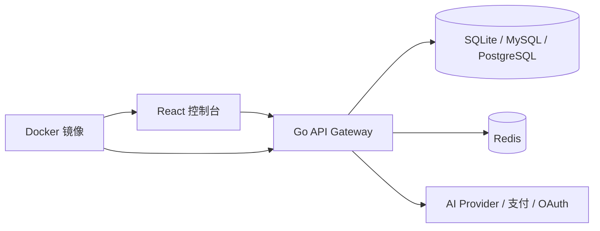
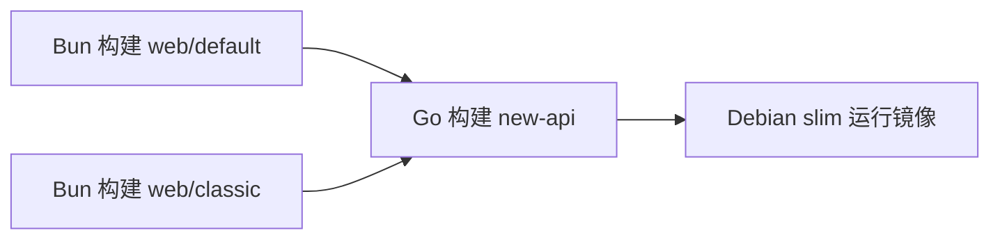

# 项目技术栈

本文基于当前源码、`go.mod`、前端 `package.json`、构建配置和主要入口文件整理，说明本项目后端、前端以及部署/工程化中使用的核心技术栈及其主要功能。

## 1. 技术栈总览

本项目是一个 AI API 网关/代理系统：

- 后端：Go + Gin + GORM，负责 API 网关、用户/令牌/渠道管理、计费、任务轮询、支付、OAuth、日志、缓存、AI Provider 转发。
- 前端：新版 `web/default` 使用 React 19 + TypeScript + Rsbuild + TanStack Router/Query + Base UI/Tailwind；旧版 `web/classic` 使用 React 18 + Vite + Semi UI。
- 存储：主数据库支持 SQLite、MySQL、PostgreSQL；缓存支持 Redis 和内存缓存。
- 部署：Docker 多阶段构建，先构建两套前端，再把前端 dist 嵌入 Go 二进制。

## 2. 后端核心技术栈

| 技术 | 位置/依赖 | 主要功能 | 在项目中的用途 |
| --- | --- | --- | --- |
| Go | `go.mod` | 后端主语言，适合高并发网络服务和单二进制部署 | 实现 API 网关、Relay、计费、后台任务、数据库访问 |
| Gin | `github.com/gin-gonic/gin`、`gin-contrib/*` | HTTP Web 框架、中间件、路由分组 | `/api` 管理接口、`/v1` Relay 接口、前端静态资源服务 |
| GORM | `gorm.io/gorm` | ORM、模型映射、迁移、查询构造 | `model/` 层管理用户、渠道、令牌、订阅、日志、任务等数据 |
| SQLite 驱动 | `github.com/glebarez/sqlite` | 嵌入式数据库 | 默认/轻量部署场景 |
| MySQL 驱动 | `gorm.io/driver/mysql` | MySQL 数据库访问 | 生产部署可选数据库 |
| PostgreSQL 驱动 | `gorm.io/driver/postgres` | PostgreSQL 数据库访问 | Docker Compose 默认数据库 |
| Redis | `github.com/go-redis/redis/v8` | 分布式缓存、限流、临时状态 | token/用户/渠道缓存、限流、多节点同步辅助 |
| JWT | `github.com/golang-jwt/jwt/v5` | 无状态 token 解析与签名 | API token、认证相关能力 |
| Session Cookie | `github.com/gin-contrib/sessions` | 浏览器会话管理 | 控制台登录态 |
| WebSocket | `github.com/gorilla/websocket` | 双向实时连接 | OpenAI Realtime 兼容接口 |
| go-i18n | `github.com/nicksnyder/go-i18n/v2` | 后端国际化 | 后端错误消息和提示文本多语言 |
| Validator | `github.com/go-playground/validator/v10` | 结构体字段校验 | 请求参数和配置校验 |
| gjson / sjson | `github.com/tidwall/gjson`、`github.com/tidwall/sjson` | 高性能 JSON 路径读取/修改 | 快速读取请求中的 `model`、表达式计费 `param()`、参数覆盖 |
| decimal | `github.com/shopspring/decimal` | 精确小数计算 | 支付金额、价格和计费计算，避免浮点误差 |
| expr | `github.com/expr-lang/expr` | 表达式编译与执行 | `pkg/billingexpr` 实现阶梯/动态计费表达式 |
| tiktoken-go | `github.com/tiktoken-go/tokenizer` | token 编码/估算 | 请求预估 token 数和预扣费 |
| Aho-Corasick | `github.com/anknown/ahocorasick` | 多模式字符串匹配 | 敏感词检测 |
| WebAuthn | `github.com/go-webauthn/webauthn` | Passkey / FIDO2 认证 | 用户 Passkey 登录、注册、验证 |
| TOTP | `github.com/pquerna/otp` | 一次性验证码 | 2FA 双因素认证 |
| AWS SDK v2 | `github.com/aws/aws-sdk-go-v2` | AWS 服务访问 | AWS Bedrock 渠道适配 |
| Stripe SDK | `github.com/stripe/stripe-go/v81` | Stripe 支付 | 充值和订阅支付 |
| Epay SDK | `github.com/Calcium-Ion/go-epay` | Epay 支付 | 充值和订阅支付 |
| Waffo SDK | `github.com/waffo-com/waffo-go`、`waffo-pancake-sdk-go` | Waffo 支付 | 充值、订阅、Pancake 商品/订单 |
| Pyroscope | `github.com/grafana/pyroscope-go` | 性能剖析 | 可选运行时 profiling |
| gopsutil | `github.com/shirou/gopsutil` | 系统资源采集 | 系统监控、性能面板 |
| sonic / goccy / json-iterator | 间接依赖，项目包装在 `common/json.go` | 高性能 JSON 生态 | 当前业务代码统一通过 `common.Marshal/Unmarshal` 使用 JSON |
| YAML | `gopkg.in/yaml.v3` | YAML 解析 | 后端 i18n 语言包 |
| Testify | `github.com/stretchr/testify` | 测试断言 | Go 单元测试 |

## 3. 后端技术栈如何分布

### 3.1 Web API 与中间件

后端 HTTP 层由 Gin 负责：

- `router/` 注册 API 分组和中间件。
- `middleware/` 实现认证、限流、CORS、gzip、请求 ID、请求体复用、渠道分发、性能保护。
- `controller/` 实现具体 handler。

相关技术：

| 技术 | 功能 |
| --- | --- |
| Gin Router | 路由分组、参数读取、JSON 响应 |
| Gin Middleware | 鉴权、限流、日志、分发、错误恢复 |
| gin-contrib/gzip | HTTP 响应压缩 |
| gin-contrib/cors | 跨域请求支持 |
| gin-contrib/static | 内嵌前端静态资源服务 |
| gin-contrib/sessions | 控制台 session cookie |

### 3.2 数据库与模型

数据访问集中在 `model/`：

- 使用 GORM 定义模型和 CRUD。
- `model/main.go` 根据 `SQL_DSN` 选择 SQLite、MySQL 或 PostgreSQL。
- 迁移通过 `AutoMigrate` 和少量兼容性 SQL 完成。
- 对不同数据库的保留字列名、布尔值、DDL 能力做兼容处理。

相关技术：

| 技术 | 功能 |
| --- | --- |
| GORM | ORM、迁移、事务、查询构造 |
| SQLite | 本地默认数据库，便于单机部署 |
| MySQL | 生产可选关系数据库 |
| PostgreSQL | Docker Compose 默认关系数据库 |
| GORM Transaction | 支付、订阅、额度扣减等一致性操作 |

### 3.3 缓存、限流与状态

项目使用 Redis + 内存缓存的组合：

- Redis 由 `common/redis.go` 初始化。
- 渠道缓存、用户缓存、token 缓存由 `model/*_cache.go` 管理。
- 限流使用 Redis 或内存状态。
- `pkg/cachex` 提供更通用的混合缓存封装。

相关技术：

| 技术 | 功能 |
| --- | --- |
| Redis | 多节点共享缓存、限流、临时状态 |
| 内存缓存 | 单节点快速读取、Redis 未启用时降级 |
| go-redis pipeline/hash | 结构体缓存、批量写入 |
| sync / singleflight 类机制 | 降低重复加载和并发竞争 |

### 3.4 Relay 与上游 Provider 适配

Relay 相关代码集中在 `relay/` 和 `relay/channel/`：

- `relay/channel.Adaptor` 定义同步 Provider 的统一接口。
- `relay/channel.TaskAdaptor` 定义异步任务 Provider 的统一接口。
- `relay/helper` 负责请求校验、模型映射、价格计算、流式扫描。
- `relay/common.RelayInfo` 承载一次请求的 token、用户、渠道、模型、计费、流式状态等上下文。

相关技术：

| 技术 | 功能 |
| --- | --- |
| net/http | 上游 API 请求 |
| SSE / 流式扫描 | OpenAI/Claude/Gemini 等流式响应转发 |
| WebSocket | Realtime API |
| JSON 路径解析 | 请求模型快速提取、参数覆盖 |
| Provider SDK | AWS Bedrock 等专用渠道 |

### 3.5 计费与表达式系统

计费链路使用普通倍率和表达式计费两套机制：

- 普通倍率：`setting/ratio_setting` + `model/pricing`。
- 表达式计费：`setting/billing_setting` + `pkg/billingexpr` + `relay/helper/price.go` + `service/tiered_settle.go`。

相关技术：

| 技术 | 功能 |
| --- | --- |
| expr-lang/expr | 编译和执行计费表达式 |
| AST introspection | 识别表达式使用了哪些 token 变量 |
| decimal / float 规则 | 金额和额度转换 |
| GORM 事务 | 钱包/订阅预扣、结算、退款 |

### 3.6 认证与安全

相关能力分散在 `middleware/auth.go`、`controller/passkey.go`、`service/passkey/`、`model/twofa.go` 等文件。

| 技术 | 功能 |
| --- | --- |
| Session Cookie | 控制台登录态 |
| JWT / API Token | API 调用身份认证 |
| WebAuthn | Passkey 登录 |
| TOTP | 2FA 验证码 |
| Turnstile | 人机验证 |
| SSRF 防护 | 远程文件/URL 获取安全校验 |
| bcrypt/crypto | 密码哈希、随机 token、签名验证 |

### 3.7 支付和外部服务

| 技术/SDK | 功能 |
| --- | --- |
| Stripe SDK | Stripe Checkout、Webhook、订阅/充值支付 |
| go-epay | Epay 支付和回调 |
| Waffo / Waffo Pancake SDK | Waffo 支付、商品、订单、订阅商品 |
| OAuth/OIDC | 第三方登录和账号绑定 |
| io.net API client | 模型部署、容器、硬件、价格估算 |
| Uptime Kuma API | 状态页/健康检查信息 |

## 4. 前端新版 `web/default` 技术栈

`web/default` 是当前主前端，使用 TypeScript、React 19 和现代构建工具链。

| 技术 | 位置/依赖 | 主要功能 | 在项目中的用途 |
| --- | --- | --- | --- |
| React 19 | `react`、`react-dom` | UI 渲染和组件模型 | 控制台页面、表单、弹窗、布局、Playground |
| TypeScript | `typescript` | 静态类型检查 | 页面、组件、API client、hooks、stores |
| Rsbuild 2 | `@rsbuild/core` | 前端构建工具，基于 Rspack | 开发服务器、生产构建、代码分包 |
| Rspack | Rsbuild 内部 | 高性能打包器 | vendor chunk、路由代码拆分 |
| TanStack Router | `@tanstack/react-router` | 类型安全文件路由 | `src/routes` 文件路由、鉴权/初始化 beforeLoad |
| TanStack Query | `@tanstack/react-query` | 服务端状态管理 | API 数据缓存、重试、错误处理、Devtools |
| TanStack Table | `@tanstack/react-table` | 表格状态和渲染逻辑 | 渠道、用户、日志、模型等管理表格 |
| TanStack Virtual | `@tanstack/react-virtual` | 虚拟滚动 | 大列表/表格性能优化 |
| Axios | `axios` | HTTP 客户端 | `src/lib/api.ts` 统一封装 `/api` 请求、错误处理、GET 去重 |
| Zustand | `zustand` | 客户端状态管理 | 登录态、通知、系统配置等 store |
| i18next | `i18next`、`react-i18next` | 前端国际化 | `en/zh/fr/ja/ru/vi` 多语言 |
| Base UI | `@base-ui/react` | 无样式/低层 UI primitive | 新版 UI 组件基础 |
| shadcn 配置 | `components.json` | 组件生成/组织约定 | `@/components/ui`、Tailwind CSS 变量、Hugeicons 图标库 |
| Tailwind CSS 4 | `tailwindcss`、`@tailwindcss/postcss` | 原子化 CSS | 页面布局、主题变量、响应式样式 |
| Hugeicons / Lucide / React Icons | `@hugeicons/*`、`lucide-react`、`react-icons` | 图标库 | 按钮、菜单、状态、导航图标 |
| Sonner | `sonner` | Toast 通知 | 全局成功/失败提示 |
| React Hook Form | `react-hook-form` | 表单状态 | 设置、登录、创建/编辑表单 |
| Zod | `zod` | Schema 校验 | 表单和数据校验 |
| VChart / Recharts | `@visactor/vchart`、`recharts` | 图表 | 用量、性能、排行榜、统计图 |
| Motion | `motion` | 动画 | 页面/组件过渡 |
| next-themes | `next-themes` | 主题切换 | 明暗主题和系统主题 |
| date-fns / dayjs | `date-fns`、`dayjs` | 日期处理 | 日志、账单、统计时间展示 |
| SSE.js | `sse.js` | SSE 客户端 | Playground/流式接口场景 |
| AI SDK | `ai` | AI 前端辅助能力 | AI elements / Playground 相关能力 |
| Streamdown / React Markdown / Shiki | Markdown 和代码高亮 | 聊天/文档/模型输出展示 |
| Tokenlens | `tokenlens` | token 估算/展示辅助 | Playground 或文本统计 |

## 5. `web/default` 工程结构与技术职责

| 目录 | 技术职责 |
| --- | --- |
| `src/main.tsx` | React 入口，创建 QueryClient、Router、Theme/Font/Direction Provider |
| `src/routes/` | TanStack Router 文件路由，生成 `routeTree.gen.ts` |
| `src/features/` | 按业务域拆分页面和组件，如 channels、users、keys、wallet、subscriptions |
| `src/components/ui/` | shadcn 风格的基础 UI 组件 |
| `src/components/data-table/` | 表格组件和 TanStack Table 封装 |
| `src/lib/api.ts` | Axios 实例、拦截器、业务 API 函数 |
| `src/stores/` | Zustand store |
| `src/hooks/` | 响应式、系统配置、权限、表格 URL 状态等 hooks |
| `src/i18n/` | i18next 配置和语言包 |
| `src/styles/index.css` | Tailwind 入口、CSS 变量、主题样式 |
| `rsbuild.config.ts` | Rsbuild/Rspack 配置、代理、分包、TanStack Router 插件 |
| `components.json` | shadcn 组件体系配置，定义别名、Tailwind CSS 文件、图标库、registry |

## 6. 前端旧版 `web/classic` 技术栈

`web/classic` 是旧版控制台，仍被构建并嵌入后端，供主题切换或兼容使用。

| 技术 | 主要功能 | 在项目中的用途 |
| --- | --- | --- |
| React 18 | UI 框架 | 旧版控制台页面 |
| Vite | 构建和开发服务器 | `vite.config.js` 配置开发代理和分包 |
| Semi UI | 字节系 UI 组件库 | 表单、表格、弹窗、布局等旧版 UI |
| react-router-dom | 客户端路由 | 旧版页面路由 |
| Axios | HTTP 请求 | 调用后端 `/api` |
| i18next | 国际化 | 旧版语言包 |
| Tailwind CSS 3 | CSS 工具类 | 与 Semi 变量结合的样式扩展 |
| VChart / Recharts 类图表库 | 数据可视化 | 控制台统计图 |
| react-toastify | Toast 通知 | 旧版全局提示 |
| react-turnstile | Turnstile 人机验证 | 登录/注册等关键操作 |
| react-markdown / marked / mermaid / katex | Markdown、图表、公式渲染 | 内容展示 |

新版和旧版前端都会构建为 `dist`，由 Go 后端通过 `embed.FS` 打包进二进制。

## 7. 前后端通信技术

| 技术 | 功能 |
| --- | --- |
| REST JSON | 控制台管理 API，统一 `{ success, message, data }` 业务响应 |
| OpenAI-compatible HTTP API | `/v1/chat/completions`、`/v1/responses`、`/v1/images/*`、`/v1/audio/*` 等 |
| Claude-compatible API | `/v1/messages` |
| Gemini-compatible API | `/v1beta/models/*` |
| SSE | 流式文本响应 |
| WebSocket | Realtime API |
| Multipart/FormData | 图片编辑、音频转录、文件上传类请求 |
| Cookie Session | 控制台浏览器登录态 |
| Bearer/API Key | API 客户端调用鉴权 |

## 8. 构建与部署技术栈

| 技术 | 位置 | 主要功能 |
| --- | --- | --- |
| Bun | `web/default/package.json`、`web/classic/package.json`、`Dockerfile` | 前端包管理、脚本执行、构建 |
| Rsbuild | `web/default/rsbuild.config.ts` | 新版前端开发/生产构建 |
| Vite | `web/classic/vite.config.js` | 旧版前端开发/生产构建 |
| TypeScript Compiler | `bun run typecheck` | 新版前端类型检查 |
| ESLint | `eslint.config.js` | 新版前端静态检查 |
| Prettier | package scripts / classic config | 前端格式化 |
| Go Build | `Dockerfile` | 构建后端单二进制 |
| go:embed | `main.go` | 把两套前端 dist 嵌入后端二进制 |
| Docker 多阶段构建 | `Dockerfile` | 前端构建、Go 构建、运行镜像分离 |
| Docker Compose | `docker-compose.yml` | 编排后端、Redis、PostgreSQL，可切换 MySQL |
| systemd | `new-api.service` | Linux 服务部署 |
| Electron | `electron/` | 桌面托盘包装 |

Docker 构建链路：

## 9. 技术栈在业务中的作用总结

| 业务能力 | 关键技术 |
| --- | --- |
| AI API 网关 | Gin、net/http、Relay Adaptor、SSE、WebSocket、DTO 转换 |
| 多 Provider 接入 | `relay/channel.Adaptor`、Provider SDK、模型映射、Header/URL 转换 |
| 渠道分发 | Gin middleware、GORM、Redis/内存缓存、权重/优先级算法 |
| 用户和权限 | Session、JWT/API Token、GORM、Passkey、TOTP |
| 计费和扣费 | GORM 事务、decimal、expr、tiktoken、价格/倍率配置 |
| 订阅和充值 | Stripe、Epay、Waffo、Webhook、数据库事务 |
| 控制台 | React、TanStack Router、TanStack Query、Axios、Base UI、Tailwind |
| 国际化 | go-i18n、i18next、多语言 JSON/YAML |
| 性能与监控 | Redis、gopsutil、Pyroscope、perf_metrics、日志系统 |
| 部署交付 | Bun、Rsbuild、Vite、Go build、go:embed、Docker Compose |

## 10. 注意事项

1. 后端业务代码应统一使用 `common/json.go` 中的 JSON 包装函数进行 marshal/unmarshal。
2. 数据库相关代码需要同时兼容 SQLite、MySQL 和 PostgreSQL。
3. 前端新增 UI 文案时，需要维护 `web/default/src/i18n/locales` 下的多语言翻译。
4. 新版前端优先使用 Bun 执行脚本，例如 `bun run build`、`bun run i18n:sync`。
5. 新增 Provider 时要同时关注 Relay 适配、模型价格、渠道测试、stream options、计费和日志。
6. 当前 shell 环境没有 `go` 命令，本次分析未执行 Go 编译或测试，技术栈结论来自源码和配置文件阅读。

