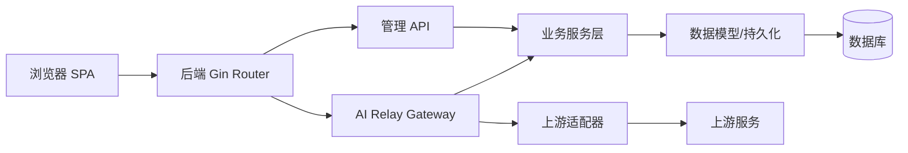
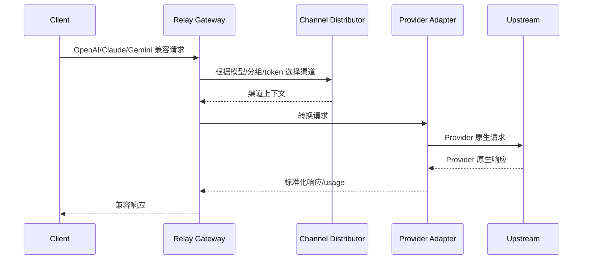
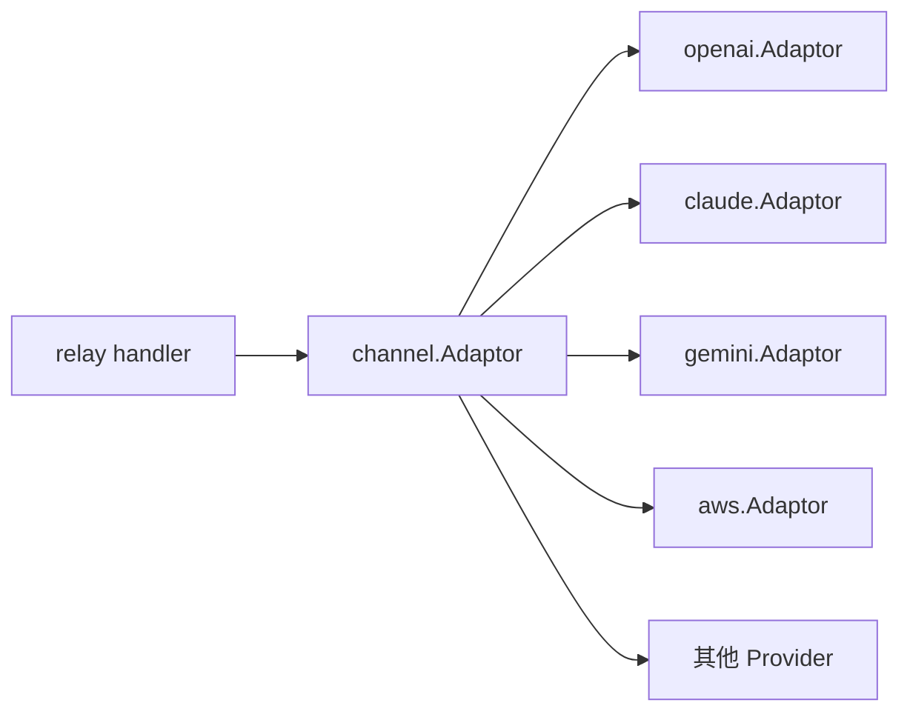
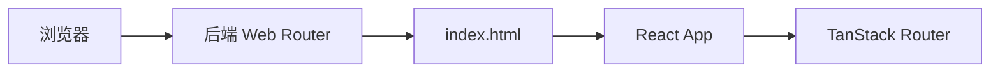

# 项目架构模式

本文基于当前源码结构、后端入口与路由、Relay 适配器、Service/Model 分层、前端路由和 feature 目录整理，说明项目中前端、后端分别采用了哪些架构模式，以及这些模式解决了什么问题。

## 1. 总体架构判断

本项目整体是一个“前后端同仓 + 后端内嵌前端静态资源 + AI API 网关”的应用。

从宏观上看：

- 后端采用分层架构为主，叠加 API Gateway / Proxy、Adapter、Strategy、Middleware Pipeline、Background Worker、Cache Aside 等模式。
- 前端新版采用 SPA 架构，叠加 File-based Routing、Feature-based 分包、Server State / Client State 分离、Provider/Context、Hooks 组合等模式。
- 前端旧版采用更传统的 Page-based SPA，页面、hooks、context、services 分层较明显。



## 2. 后端架构模式

## 2.1 分层架构

后端最基础的模式是分层架构：

```text
router -> middleware -> controller -> service -> model
                         controller -> relay -> relay/channel
```

| 层级 | 代码位置 | 主要职责 |
| --- | --- | --- |
| 路由层 | `router/` | 注册 URL、HTTP 方法、中间件组合 |
| 中间件层 | `middleware/` | 认证、限流、请求体复用、日志、渠道分发、性能保护 |
| 控制器层 | `controller/` | HTTP handler，参数读取、权限边界、响应格式、调用业务 |
| 服务层 | `service/` | 业务逻辑、计费、任务、渠道选择、支付、通知、文件处理 |
| 数据层 | `model/` | GORM 模型、迁移、CRUD、缓存、事务 |
| Relay 层 | `relay/` | AI 请求校验、转发编排、请求/响应转换、价格计算 |
| Provider 层 | `relay/channel/` | 具体上游 Provider 适配 |

这个模式的好处是把 HTTP、业务规则、持久化、上游协议转换分开，让管理 API 和 AI Relay API 可以复用同一批 service/model 能力。

## 2.2 MVC / Controller-Service-Model 变体

项目不是传统模板渲染式 MVC，而是 REST API 场景下的 Controller-Service-Model 变体：

- `controller` 类似 MVC 中的 Controller。
- `model` 承担 Model 和 Repository 的混合职责。
- View 由前端 React 控制台承担。
- `service` 是额外抽出的业务领域层。

典型例子：

```text
router/api-router.go
  -> controller/channel.go
  -> service/channel_select.go 或 model/channel.go
  -> model/channel_cache.go / DB
```

## 2.3 API Gateway / Proxy 模式

项目的核心业务是 AI API 网关：

- 对下游暴露 OpenAI、Claude、Gemini、Midjourney、Suno、视频等兼容接口。
- 对上游隐藏不同 Provider 的 URL、认证方式、请求格式和响应格式差异。
- 在转发过程中插入鉴权、限流、渠道选择、计费、日志、重试、敏感词检测。

相关代码：

| 位置 | 作用 |
| --- | --- |
| `router/relay-router.go` | 注册 `/v1`、`/v1beta`、`/mj`、`/suno` 等兼容接口 |
| `middleware/distributor.go` | 选择可用渠道，并把渠道元信息写入请求上下文 |
| `controller/relay.go` | Relay 总编排：校验、计费、转发、重试、错误响应 |
| `relay/*_handler.go` | 按接口类型处理 text/image/audio/embedding/rerank/realtime |
| `relay/channel/*` | 上游 Provider 适配 |



## 2.4 Middleware Pipeline 模式

Gin 中间件形成请求管道，逐步给请求补充上下文或提前拦截：

```text
Request
  -> RequestId
  -> I18n
  -> Logger
  -> Auth
  -> RateLimit
  -> BodyStorage
  -> Distribute
  -> Controller
```

典型中间件职责：

| 中间件 | 模式作用 |
| --- | --- |
| `TokenAuth` / `UserAuth` | 认证关卡 |
| `GlobalAPIRateLimit` / `ModelRequestRateLimit` | 限流关卡 |
| `BodyStorageCleanup` | 让后续多个阶段可重复读取请求体 |
| `Distribute` | 把“选择渠道”作为进入 controller 前的管道步骤 |
| `StatsMiddleware` / `SetUpLogger` | 横切关注点，统计和日志 |

这是典型的 Chain of Responsibility：每个中间件只处理自己的职责，失败时中断链路，成功时 `c.Next()`。

## 2.5 Adapter 模式

上游 Provider 的接口差异很大，项目用 Adapter 模式统一它们。

核心接口在 `relay/channel/adapter.go`：

- `Adaptor`：同步请求适配器，负责 URL、Header、请求转换、响应处理、模型列表。
- `TaskAdaptor`：异步任务适配器，负责提交任务、查询任务、解析结果、任务计费调整。

`relay/relay_adaptor.go` 通过 `GetAdaptor(apiType)` 和 `GetTaskAdaptor(platform)` 返回具体实现。



这个模式让 Relay 主流程不需要关心“当前上游是 OpenAI 还是 Gemini”，只调用统一接口即可。

## 2.6 Strategy 模式

项目中多处使用策略模式，根据运行时条件选择不同算法或实现。

| 场景 | 代码位置 | 策略 |
| --- | --- | --- |
| 渠道选择 | `service/channel_select.go`、`model/channel_cache.go` | 普通分组、auto 分组、优先级、权重、重试 |
| 资金来源 | `service/funding_source.go` | 钱包 `WalletFunding` 或订阅 `SubscriptionFunding` |
| 计费方式 | `relay/helper/price.go`、`service/tiered_settle.go` | 普通倍率计费或表达式阶梯计费 |
| 上游适配 | `relay/relay_adaptor.go` | 根据 APIType 选择具体 Provider adapter |
| 任务轮询 | `service/task_polling.go` | 根据 TaskPlatform 选择任务更新逻辑 |
| 前端路由鉴权 | `web/default/src/routes/_authenticated/*.tsx` | 根据用户角色、setup 状态、session 状态决定跳转 |

`FundingSource` 是最清晰的策略接口示例：

```text
BillingSession
  -> FundingSource
      -> WalletFunding
      -> SubscriptionFunding
```

## 2.7 Session / Unit of Work 风格

`service/billing_session.go` 中的 `BillingSession` 封装一次请求的计费生命周期：

```text
PreConsume -> Reserve -> Settle / Refund
```

它把“资金来源预扣、token 额度预扣、补扣、退款、幂等保护、失败回滚”等状态放在一个会话对象里，类似 Unit of Work / Session Object：

- 会话持有 `relayInfo`、资金来源、预扣额度、是否已结算、是否已退款。
- 对外提供 `Settle()`、`Refund()`、`Reserve()`。
- 内部用锁保证同一会话不会重复结算或重复退款。

这种模式适合 Relay 请求：请求可能成功、失败、重试、部分结算，必须让状态转换明确。

## 2.8 DTO / Contract 模式

`dto/` 和 `types/` 构成跨层契约：

- `dto` 定义外部协议和内部请求/响应结构，如 OpenAI、Claude、Gemini、Audio、Image、Task。
- `types` 定义通用错误、RelayFormat、PriceData、FileSource 等。
- Controller、Service、Relay 和 Adapter 都围绕这些结构传递数据。

这减少了直接使用 `map[string]any` 的范围，让复杂协议转换尽量有类型约束。

## 2.9 Repository / Active Record 混合模式

`model/` 不是纯 Repository，也不是纯 Active Record，而是混合模式：

- GORM struct 是数据实体。
- 同一包中提供 `GetUserById()`、`GetTokenByKey()`、`RecordConsumeLog()`、`PreConsumeUserSubscription()` 等查询/命令函数。
- 一些实体有方法，如 `Channel.GetPriority()`、`Task.UpdateWithStatus()`。

这类模式在 Go 项目里常见，优点是简单直接；代价是 model 层会同时包含实体、查询、事务和部分领域逻辑。

## 2.10 Cache Aside 模式

缓存通常由业务显式维护，而不是透明代理：

| 缓存 | 代码位置 | 模式 |
| --- | --- | --- |
| 渠道缓存 | `model/channel_cache.go` | 启动/周期从 DB 重建内存索引，请求读取缓存 |
| 用户缓存 | `model/user_cache.go` | 查询时读缓存，更新时同步/失效 |
| Token 缓存 | `model/token_cache.go` | token 鉴权快速读取 |
| 配置缓存 | `model/option.go` + `setting/*` | 从 options 表加载到内存配置对象 |
| 渠道亲和缓存 | `service/channel_affinity.go` | 请求成功后记录，下次优先选择 |

典型流程：

```text
Read request -> check memory/Redis cache -> miss then DB -> rebuild/update cache
```

## 2.11 Background Worker / Scheduler 模式

`main.go` 启动多个 goroutine 执行后台任务：

- 渠道缓存同步：`model.SyncChannelCache`
- 配置热更新：`model.SyncOptions`
- 用量看板刷新：`model.UpdateQuotaData`
- 渠道自动测试：`controller.AutomaticallyTestChannels`
- 上游模型更新：`controller.StartChannelUpstreamModelUpdateTask`
- Codex 凭证刷新：`service.StartCodexCredentialAutoRefreshTask`
- 订阅额度重置：`service.StartSubscriptionQuotaResetTask`
- 异步任务轮询：`service.TaskPollingLoop`

这些是典型后台 Worker：不直接响应某个 HTTP 请求，但维护系统状态。

## 2.12 Registry / Config Manager 模式

`setting/config.ConfigManager` 是配置注册中心：

1. 各配置模块在 `init()` 中 `Register(name, config)`。
2. `model.InitOptionMap()` 从 DB 加载 options。
3. `LoadFromDB()` 通过反射把配置写入结构体。

这个模式把配置定义分散在业务包中，把加载和保存逻辑集中到一个 registry。

## 2.13 Dependency Injection 的轻量用法

Go 项目中没有使用完整 DI 容器，但有轻量注入：

```go
service.GetTaskAdaptorFunc = func(platform constant.TaskPlatform) service.TaskPollingAdaptor {
    return relay.GetTaskAdaptor(platform)
}
```

这用于打破 `service -> relay -> service` 的循环依赖。它本质上是函数注入：service 只依赖接口/函数，不直接 import relay。

## 3. 前端新版 `web/default` 架构模式

## 3.1 SPA 单页应用模式

`web/default` 是典型 SPA：

- `src/main.tsx` 创建 React root。
- 使用 `RouterProvider` 接管前端路由。
- 后端 `router/web-router.go` 对非 API 路径返回前端 `index.html`，由浏览器端路由继续处理。



## 3.2 File-based Routing 模式

新版前端使用 TanStack Router 的文件路由：

- 路由文件在 `src/routes/`。
- `routeTree.gen.ts` 自动生成路由树。
- `createFileRoute()` 定义页面、loader/beforeLoad、搜索参数校验。
- `_authenticated` 目录承载需要登录的布局和路由守卫。

典型例子：

| 文件 | 模式作用 |
| --- | --- |
| `routes/__root.tsx` | 根路由、全局 Provider、setup 检查、错误页 |
| `routes/_authenticated/route.tsx` | 登录态守卫和后台布局 |
| `routes/_authenticated/channels/index.tsx` | 管理员权限守卫、搜索参数 schema、挂载 Channels feature |

## 3.3 Feature-based / Feature-Sliced 模式

新版前端不是按“components/pages/apis”全局平铺，而是大量按业务 feature 组织：

```text
features/channels/
  api.ts
  components/
  hooks/
  lib/
  types.ts
  constants.ts
  index.tsx
```

每个 feature 内部通常包含：

| 子目录/文件 | 职责 |
| --- | --- |
| `api.ts` | 该业务域的后端 API 调用 |
| `types.ts` | 该业务域类型和 zod schema |
| `constants.ts` | 状态、选项、文案 key、枚举映射 |
| `components/` | 业务组件、表格、弹窗、按钮 |
| `hooks/` | 业务 hooks，封装 mutation、轮询、交互状态 |
| `lib/` | 纯函数、数据转换、校验、query keys、动作封装 |
| `index.tsx` | feature 页面入口，组合布局和子组件 |

这种模式降低了跨业务耦合：渠道、用户、订阅、钱包、日志、模型等功能可以各自演进。

## 3.4 Server State / Client State 分离

新版前端明显区分两类状态：

| 状态类型 | 技术 | 例子 |
| --- | --- | --- |
| Server State | TanStack Query | 渠道列表、用户列表、日志、模型、订阅、价格 |
| Client State | Zustand / React state / Context | 当前用户缓存、系统配置、弹窗开关、当前行、主题、侧边栏 |

典型代码：

- `main.tsx` 创建全局 `QueryClient`。
- feature 中用 `useMutation()` 和 `queryClient.invalidateQueries()` 更新服务端数据缓存。
- `stores/auth-store.ts` 用 Zustand 保存登录用户，并持久化到 localStorage。
- `components/channels-provider.tsx` 用 Context 保存渠道页面内的弹窗和当前行状态。

这种分离让“后端数据缓存”和“纯 UI 状态”不会混在一起。

## 3.5 API Client / Repository for Frontend 模式

`src/lib/api.ts` 是全局 HTTP client：

- 创建 Axios 实例。
- 配置 cookie、通用 header。
- 拦截响应中的业务错误。
- 处理 401 session 过期。
- 对重复 GET 做 in-flight 去重。

各 feature 再提供自己的 `api.ts`，例如 `features/channels/api.ts`：

```text
lib/api.ts       -> 通用 HTTP 能力
features/*/api.ts -> 业务接口函数
components/hooks  -> 调用业务接口
```

这相当于前端的轻量 Repository/API Service 层。

## 3.6 Provider / Context 模式

前端使用 Provider 分层提供全局或局部能力：

| Provider | 位置 | 功能 |
| --- | --- | --- |
| `QueryClientProvider` | `main.tsx` | 全局服务端状态缓存 |
| `ThemeProvider` | `main.tsx` | 明暗主题 |
| `FontProvider` | `main.tsx` | 字体配置 |
| `DirectionProvider` | `main.tsx` | 文本方向 |
| `ThemeCustomizationProvider` | `routes/__root.tsx` | 主题自定义 |
| `ChannelsProvider` | `features/channels/components/channels-provider.tsx` | 渠道页面弹窗、当前行、tag 模式、上游更新状态 |

全局 Provider 放在入口或根路由，feature Provider 放在业务入口，避免局部 UI 状态泄漏到全局。

## 3.7 Hooks 组合模式

项目大量使用自定义 hooks 封装复用逻辑：

- `useSystemConfig()`：加载系统配置、预加载 logo、同步 favicon。
- `useChannelMutateForm()`：封装渠道创建/更新 mutation。
- `useChannelUpstreamUpdates()`：封装上游模型更新弹窗和请求状态。
- `useTableUrlState()`：表格状态与 URL 查询参数联动。
- `useMobile()` / `useMediaQuery()`：响应式判断。

Hooks 模式让组件保持组合式：组件负责布局和交互，复杂状态逻辑放入 hook。

## 3.8 Schema Validation 模式

前端用 Zod 做运行时 schema：

- 路由搜索参数校验：`routes/_authenticated/channels/index.tsx`
- 业务实体类型推导：`features/channels/types.ts`
- 表单数据校验：`features/channels/lib/channel-form.ts`

这是一种“类型 + 运行时校验”的边界保护模式，适合后端数据可能变化的管理系统。

## 3.9 Component Composition 模式

前端 UI 不是巨型页面组件，而是组合：

```text
Channels
  -> SectionPageLayout
  -> ChannelsPrimaryButtons
  -> ChannelsTable
  -> ChannelsDialogs
```

通用组件也偏组合式：

- `components/data-table/*` 封装表格页、toolbar、pagination、bulk actions、mobile card list。
- `components/ui/*` 作为基础 UI primitive。
- feature 组件只提供业务列、业务 action、业务弹窗。

这让表格、弹窗、布局可以跨用户、渠道、日志、模型等页面复用。

## 3.10 Route Guard / Access Control 模式

前端路由使用 `beforeLoad` 做守卫：

- 根路由检查 setup 状态。
- `_authenticated` 检查本地用户和 session。
- 管理页面检查角色，比如渠道页要求 admin。

后端仍是最终权限边界，前端守卫主要提升体验，避免用户进入无权限页面。

## 4. 前端旧版 `web/classic` 架构模式

旧版前端更接近传统 Page-based SPA：

| 模式 | 代码位置 | 说明 |
| --- | --- | --- |
| Page-based Routing | `web/classic/src/App.jsx`、`pages/*` | 使用 `react-router-dom` 手写路由表 |
| Layout Wrapper | `PageLayout` | 全局页面框架包裹路由内容 |
| Context State | `context/User`、`context/Status`、`context/Theme` | 用户、系统状态、主题 |
| Route Guard | `helpers` 中的 `PrivateRoute`、`AdminRoute` | 登录和管理员权限控制 |
| Hooks by Domain | `hooks/users`、`hooks/channels`、`hooks/playground` 等 | 按业务抽取数据加载和交互逻辑 |
| Services | `services/` | 部分通用服务，如安全验证 |
| Lazy Loading | `React.lazy`、`Suspense` | 公共页面延迟加载 |

旧版架构更集中在页面层，新版架构更强调 feature 内聚和类型安全。

## 5. 前后端协作模式

## 5.1 BFF-ish 管理 API

控制台不是直接访问数据库或上游服务，而是通过后端 `/api/**`：

```text
React feature api.ts -> /api/... -> controller -> service/model
```

后端承担类似 BFF 的角色：

- 聚合用户权限、配置、价格、日志等数据。
- 屏蔽支付/OAuth/Provider 内部细节。
- 返回前端友好的 `{ success, message, data }`。

## 5.2 兼容协议边界模式

AI 调用则不是普通 BFF，而是协议兼容网关：

```text
Client OpenAI/Claude/Gemini format
  -> backend RelayInfo
  -> Provider native format
  -> normalized response
```

`dto` 和 `relay/common.RelayInfo` 是协议边界的核心对象。

## 5.3 内嵌静态资源部署模式

前端构建产物由后端 `go:embed` 打进二进制：

```text
web/default/dist
web/classic/dist
  -> go:embed
  -> router/web-router.go
  -> Gin static/Spa fallback
```

这种模式让部署时只需要一个后端二进制/容器即可同时提供 API 和控制台。

## 6. 主要模式对照表

| 模式 | 后端是否使用 | 前端是否使用 | 主要位置 |
| --- | --- | --- | --- |
| 分层架构 | 是 | 是 | 后端 `router/controller/service/model`；前端 `routes/features/components/lib` |
| MVC 变体 | 是 | 否 | 后端 controller-service-model |
| SPA | 否 | 是 | `web/default`、`web/classic` |
| API Gateway / Proxy | 是 | 否 | `relay/`、`relay/channel/` |
| Adapter | 是 | 少量 | 后端 Provider adapter；前端 API 封装可视为轻量适配 |
| Strategy | 是 | 是 | 后端渠道/计费/资金来源；前端路由守卫/表格配置 |
| Middleware Pipeline | 是 | 否 | Gin middleware |
| Provider / Context | 少量 | 是 | React providers、feature context |
| Hooks Composition | 否 | 是 | `web/default/src/hooks`、`features/*/hooks` |
| Server State Cache | 后端缓存 | 是 | 后端 Redis/内存；前端 TanStack Query |
| Background Worker | 是 | 否 | 后端 goroutine 任务 |
| Registry | 是 | 少量 | 后端 setting config；前端 route tree / shadcn config |
| Schema Validation | 是 | 是 | 后端 validator/dto；前端 zod |
| Component Composition | 不适用 | 是 | `components/`、`features/*/components` |

## 7. 架构优点

1. Relay 与普通管理 API 分离，避免 AI 协议转换污染管理业务。
2. Provider Adapter 让新增上游渠道有明确扩展点。
3. Service 层沉淀计费、渠道选择、任务轮询等复杂业务，controller 不至于过重。
4. `RelayInfo` 把一次 AI 请求的上下文集中管理，便于计费、日志、重试和响应处理共享。
5. 前端新版按 feature 内聚，渠道、用户、订阅、日志等模块边界清晰。
6. TanStack Query 和 Zustand 分别处理服务端状态与客户端状态，状态职责比较明确。
7. 前端构建产物内嵌后端，简化单体部署。

## 8. 架构风险与注意点

1. `model/` 同时承担实体、查询、事务和部分业务规则，长期演进时容易变厚。
2. `controller/relay.go` 是关键编排点，涉及校验、计费、重试、日志，修改时需要特别小心。
3. `service` 与 `relay/common.RelayInfo` 有较强耦合，计费逻辑变更需要同时关注 Relay 上下文。
4. 前端 feature 内部自由度较高，如果没有持续约束，`api/hooks/lib/components` 的边界可能变模糊。
5. 新旧两套前端并存，功能同步和样式体验可能出现差异。
6. 后端依赖内存缓存和周期同步时，多节点部署需要关注 Redis、同步频率和缓存一致性。
7. 当前环境没有 `go` 命令，本次分析未执行编译级依赖图或测试，结论基于源码和配置文件阅读。

