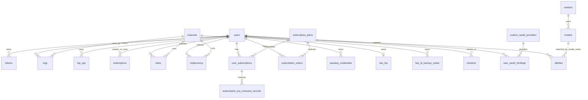

# 数据表关系

本文基于 `model/main.go` 的 `AutoMigrate` 列表和 `model/` 目录中的 GORM struct、查询逻辑整理。项目中大多数表没有在数据库层显式声明外键约束，而是通过字段命名、唯一索引、查询条件和事务逻辑形成“业务强关联”。因此本文会区分：

- 数据库主键/唯一索引：由 GORM tag 或手写迁移明确约束。
- 同表强业务字段：同一张表内共同决定状态、额度、权限、路由或幂等的字段组合。
- 跨表强业务字段：字段值指向另一张表主键或关键业务键，即使没有 DB 外键，也必须按外键关系理解。

## 1. 表总览

`model/main.go` 当前迁移的主要表如下：

| 模型 | 推断表名 | 主要功能 |
| --- | --- | --- |
| `User` | `users` | 用户、角色、额度、OAuth ID、邀请关系 |
| `Token` | `tokens` | 用户 API Token、模型限制、额度、分组 |
| `Channel` | `channels` | 上游 AI 渠道配置、key、模型、分组、状态、权重 |
| `Ability` | `abilities` | 渠道在某分组下支持某模型的能力表 |
| `Log` | `logs` | 操作日志、消费日志、错误日志、请求追踪 |
| `QuotaData` | `quota_data` | 按小时聚合的用户/模型用量看板数据 |
| `TopUp` | `top_ups` | 充值订单、支付状态 |
| `Redemption` | `redemptions` | 兑换码 |
| `SubscriptionPlan` | `subscription_plans` | 订阅计划 |
| `SubscriptionOrder` | `subscription_orders` | 订阅支付订单 |
| `UserSubscription` | `user_subscriptions` | 用户订阅实例 |
| `SubscriptionPreConsumeRecord` | `subscription_pre_consume_records` | 订阅预扣费幂等记录 |
| `Task` | `tasks` | 通用异步任务，视频/Suno/Sora/Gemini 等 |
| `Midjourney` | `midjourneys` | Midjourney 历史任务 |
| `Model` | `models` | 模型元数据 |
| `Vendor` | `vendors` | 供应商元数据 |
| `PrefillGroup` | `prefill_groups` | 预填分组配置 |
| `Option` | `options` | 系统配置 KV |
| `Setup` | `setups` | 系统初始化记录 |
| `PasskeyCredential` | `passkey_credentials` | 用户 Passkey 凭证 |
| `TwoFA` | `two_fas` | 用户 2FA 设置 |
| `TwoFABackupCode` | `two_fa_backup_codes` | 2FA 备用码 |
| `Checkin` | `checkins` | 用户签到记录 |
| `CustomOAuthProvider` | `custom_oauth_providers` | 自定义 OAuth Provider 配置 |
| `UserOAuthBinding` | `user_oauth_bindings` | 用户与自定义 OAuth Provider 绑定 |
| `PerfMetric` | `perf_metrics` | Relay 性能聚合指标 |

非持久化/辅助结构：

| 结构 | 说明 |
| --- | --- |
| `UserBase` | 用户缓存结构，不建表 |
| `ChannelInfo` | `channels.channel_info` JSON 子结构，不单独建表 |
| `Properties`、`TaskPrivateData`、`TaskBillingContext` | `tasks` 的 JSON 字段子结构 |
| `Pricing`、`PricingVendor` | 定价展示/缓存结构，不由 AutoMigrate 建表 |
| `BoundChannel`、`PerfMetricSummary`、`SubscriptionSummary` | 查询返回结构，不建表 |

## 2. 核心关系图

## 3. 主表：`users`

用户表是系统最核心主表，几乎所有业务数据都通过 `user_id` 归属到用户。

### 3.1 表功能

`users` 保存登录账号、角色、状态、额度、分组、邀请关系、内置 OAuth ID、Stripe customer、用户设置等。

### 3.2 主键与唯一字段

| 字段 | 关系/约束 | 说明 |
| --- | --- | --- |
| `id` | 主键 | 用户 ID |
| `username` | unique + index | 用户名唯一 |
| `access_token` | uniqueIndex | 管理/系统访问 token |
| `aff_code` | uniqueIndex | 邀请码唯一 |

### 3.3 同表强业务关系字段

| 字段组 | 业务含义 |
| --- | --- |
| `quota` + `used_quota` + `request_count` | 用户余额、累计消耗、请求次数，是钱包计费核心状态 |
| `role` + `status` | 权限与账号可用性；决定是否可登录、是否管理员/root |
| `group` | 用户所属分组，影响可用渠道、倍率、auto 分组 |
| `aff_code` + `aff_count` + `aff_quota` + `aff_history_quota` + `inviter_id` | 邀请关系和返利额度 |
| `github_id` / `discord_id` / `oidc_id` / `wechat_id` / `telegram_id` / `linux_do_id` | 内置 OAuth 绑定关系 |
| `setting` | 用户偏好 JSON，例如语言、订阅计费偏好等 |
| `stripe_customer` | Stripe customer ID，用于支付关系追踪 |
| `deleted_at` | 软删除标记，用户删除不是物理删除 |

### 3.4 以 `users` 为主的跨表强关联

| 从表 | 字段 | 关联 | 说明 |
| --- | --- | --- | --- |
| `tokens` | `user_id` | `tokens.user_id -> users.id` | 一个用户多个 API token |
| `logs` | `user_id` | `logs.user_id -> users.id` | 用户操作/消费/错误日志 |
| `quota_data` | `user_id` | `quota_data.user_id -> users.id` | 用户小时级用量聚合 |
| `top_ups` | `user_id` | `top_ups.user_id -> users.id` | 用户充值订单 |
| `redemptions` | `user_id`、`used_user_id` | 创建人/使用人均指向用户 | 兑换码创建和兑换关系 |
| `tasks` | `user_id` | `tasks.user_id -> users.id` | 通用异步任务归属用户 |
| `midjourneys` | `user_id` | `midjourneys.user_id -> users.id` | MJ 任务归属用户 |
| `subscription_orders` | `user_id` | 订阅订单购买人 | 订阅支付订单 |
| `user_subscriptions` | `user_id` | 用户订阅实例 | 订阅权益归属 |
| `subscription_pre_consume_records` | `user_id` | 预扣费用户 | 订阅额度幂等预扣 |
| `passkey_credentials` | `user_id` | Passkey 归属用户 | 一用户当前只允许一个 Passkey |
| `two_fas` | `user_id` | 2FA 设置归属用户 | 一用户一条 2FA 设置 |
| `two_fa_backup_codes` | `user_id` | 备用码归属用户 | 一用户多条备用码 |
| `checkins` | `user_id` | 签到记录归属用户 | 用户每日签到 |
| `user_oauth_bindings` | `user_id` | 自定义 OAuth 绑定归属用户 | 一个用户可绑定多个自定义 Provider |

## 4. 主表：`tokens`

### 4.1 表功能

`tokens` 是 API 调用凭证表，用于下游调用 `/v1/*` Relay 接口。

### 4.2 主键与唯一字段

| 字段 | 关系/约束 | 说明 |
| --- | --- | --- |
| `id` | 主键 | token ID |
| `key` | uniqueIndex | API token 明文/密钥，业务上必须唯一 |

### 4.3 同表强业务关系字段

| 字段组 | 业务含义 |
| --- | --- |
| `user_id` + `key` + `status` | token 归属、凭证和启停状态 |
| `remain_quota` + `unlimited_quota` + `used_quota` | token 级额度限制和消耗 |
| `model_limits_enabled` + `model_limits` | token 级模型白名单/限制 |
| `group` + `cross_group_retry` | token 使用分组和 auto 跨组重试 |
| `expired_time` + `accessed_time` | 有效期与最近访问时间 |
| `allow_ips` | token 可用 IP 限制 |
| `deleted_at` | token 软删除 |

### 4.4 跨表强关联

| 关联字段 | 目标 | 说明 |
| --- | --- | --- |
| `tokens.user_id` | `users.id` | token 归属用户 |
| `logs.token_id` | `tokens.id` | 消费日志记录使用的 token |
| `tasks.private_data.token_id` | `tokens.id` | 异步任务退款/结算时调整 token 额度 |

## 5. 主表：`channels`

### 5.1 表功能

`channels` 是上游 AI Provider 配置表。每条渠道包含 Provider 类型、密钥、基础 URL、支持模型、分组、权重、优先级、状态、多 key 状态和上游参数覆盖。

### 5.2 主键与核心字段

| 字段 | 关系/约束 | 说明 |
| --- | --- | --- |
| `id` | 主键 | 渠道 ID |
| `type` | 业务枚举 | Provider/渠道类型 |
| `key` | 强敏感字段 | 上游 API key 或多 key 字符串 |
| `name` | index | 渠道名称 |
| `tag` | index | 渠道标签，用于批量操作 |

### 5.3 同表强业务关系字段

| 字段组 | 业务含义 |
| --- | --- |
| `type` + `base_url` + `key` + `openai_organization` | 上游请求认证和地址配置 |
| `models` + `group` | 渠道支持的模型和分组，通常逗号分隔 |
| `model_mapping` | 下游模型到上游模型的映射 JSON |
| `status` + `auto_ban` | 渠道启停与自动禁用策略 |
| `priority` + `weight` | 渠道选择排序和随机权重 |
| `test_model` + `test_time` + `response_time` | 渠道测试相关状态 |
| `balance` + `balance_updated_time` | 上游账户余额缓存 |
| `used_quota` | 渠道累计消耗额度 |
| `status_code_mapping` | 上游错误码重映射 |
| `channel_info` | 多 key 状态、禁用原因、轮询索引等 JSON |
| `setting` + `settings` + `param_override` + `header_override` + `other_info` | 渠道高级设置、请求参数覆盖和头覆盖 |

### 5.4 以 `channels` 为主的跨表强关联

| 从表 | 字段 | 关联 | 说明 |
| --- | --- | --- | --- |
| `abilities` | `channel_id` | `abilities.channel_id -> channels.id` | 渠道在分组/模型维度的能力索引 |
| `logs` | `channel_id` | `logs.channel_id -> channels.id` | 消费/错误日志使用的渠道 |
| `tasks` | `channel_id` | `tasks.channel_id -> channels.id` | 异步任务提交渠道 |
| `midjourneys` | `channel_id` | `midjourneys.channel_id -> channels.id` | MJ 任务提交渠道 |

删除渠道时，代码会删除对应 `abilities`，这是业务级级联。

## 6. 关系表：`abilities`

### 6.1 表功能

`abilities` 是渠道可用性索引表，用于快速判断“某分组、某模型有哪些可用渠道”。

### 6.2 主键与强字段

| 字段组 | 关系/约束 | 说明 |
| --- | --- | --- |
| `group` + `model` + `channel_id` | 复合主键 | 一条能力唯一表示某渠道在某组支持某模型 |
| `enabled` | 业务状态 | 是否启用 |
| `priority` + `weight` | 选择策略 | 与 `channels.priority/weight` 配合做渠道选择 |
| `tag` | 批量操作字段 | 跟渠道 tag 同步，用于标签批量启停 |

### 6.3 跨表强关联

| 关联字段 | 目标 | 说明 |
| --- | --- | --- |
| `abilities.channel_id` | `channels.id` | 能力归属渠道 |
| `abilities.model` | `models.model_name` 或定价配置模型名 | 业务上指向模型名，但不是 ID 外键 |
| `abilities.group` | `users.group` / token `group` / ratio group | 业务上指向分组名 |

## 7. 主表：`logs`

### 7.1 表功能

`logs` 记录系统操作、充值、消费、错误、退款等日志。它可在主库或独立日志库中。

### 7.2 同表强业务关系字段

| 字段组 | 业务含义 |
| --- | --- |
| `type` + `content` + `other` | 日志类型、文本内容和扩展 JSON |
| `user_id` + `username` | 用户关联和快照用户名 |
| `token_id` + `token_name` | API token 关联和快照名称 |
| `channel_id` + `channel_name` | 渠道关联和展示名称 |
| `model_name` + `group` | 消费模型和分组 |
| `quota` + `prompt_tokens` + `completion_tokens` | 计费和 token 使用 |
| `request_id` + `upstream_request_id` | 下游请求和上游请求追踪 |
| `created_at` + `use_time` + `is_stream` | 时间、耗时、是否流式 |

### 7.3 跨表强关联

| 关联字段 | 目标 | 说明 |
| --- | --- | --- |
| `logs.user_id` | `users.id` | 日志归属用户 |
| `logs.token_id` | `tokens.id` | 消费日志使用 token |
| `logs.channel_id` | `channels.id` | 消费/错误对应渠道 |
| `logs.model_name` | `models.model_name` / 价格配置模型名 | 业务上关联模型 |

## 8. 主表：`quota_data`

### 8.1 表功能

`quota_data` 是用量看板聚合表，按小时聚合用户、模型维度的请求次数、额度和 token。

### 8.2 同表强业务关系字段

| 字段组 | 业务含义 |
| --- | --- |
| `user_id` + `username` | 用户 ID 和用户名快照 |
| `model_name` + `created_at` | 模型小时桶 |
| `count` + `quota` + `token_used` | 聚合请求数、额度、token |

代码使用 `user_id + username + model_name + created_at` 作为业务 upsert 条件。

### 8.3 跨表强关联

| 关联字段 | 目标 | 说明 |
| --- | --- | --- |
| `quota_data.user_id` | `users.id` | 用户用量 |
| `quota_data.model_name` | `models.model_name` / 定价模型名 | 模型用量 |

## 9. 主表：`top_ups`

### 9.1 表功能

`top_ups` 保存钱包充值订单，也会被订阅订单完成时用于兼容充值日志/记录。

### 9.2 主键与唯一字段

| 字段 | 关系/约束 | 说明 |
| --- | --- | --- |
| `id` | 主键 | 充值记录 ID |
| `trade_no` | unique + index | 支付订单号，回调幂等关键字段 |

### 9.3 同表强业务关系字段

| 字段组 | 业务含义 |
| --- | --- |
| `user_id` + `amount` | 充值目标用户和到账额度 |
| `money` + `payment_method` + `payment_provider` | 支付金额、展示支付方式、实际回调 Provider |
| `trade_no` + `status` | 支付回调幂等和订单状态 |
| `create_time` + `complete_time` | 下单和完成时间 |

### 9.4 跨表强关联

| 关联字段 | 目标 | 说明 |
| --- | --- | --- |
| `top_ups.user_id` | `users.id` | 充值用户 |
| `top_ups.trade_no` | `subscription_orders.trade_no` | 订阅支付完成时会 upsert 一条同 trade_no 的 topup 记录 |

## 10. 主表：`redemptions`

### 10.1 表功能

`redemptions` 保存兑换码及其使用状态。

### 10.2 主键与唯一字段

| 字段 | 关系/约束 | 说明 |
| --- | --- | --- |
| `id` | 主键 | 兑换码记录 ID |
| `key` | uniqueIndex | 兑换码唯一 |

### 10.3 同表强业务关系字段

| 字段组 | 业务含义 |
| --- | --- |
| `key` + `status` + `expired_time` | 兑换码是否可用 |
| `quota` | 兑换获得额度 |
| `user_id` | 创建者/所属者 |
| `used_user_id` + `redeemed_time` | 使用人和使用时间 |
| `deleted_at` | 软删除 |

### 10.4 跨表强关联

| 关联字段 | 目标 | 说明 |
| --- | --- | --- |
| `redemptions.user_id` | `users.id` | 创建/拥有兑换码的用户 |
| `redemptions.used_user_id` | `users.id` | 实际兑换用户 |

## 11. 主表：订阅计划与用户订阅

订阅域由四张强关联表组成：`subscription_plans`、`subscription_orders`、`user_subscriptions`、`subscription_pre_consume_records`。

### 11.1 `subscription_plans`

| 字段组 | 业务含义 |
| --- | --- |
| `title` + `subtitle` | 计划展示信息 |
| `price_amount` + `currency` | 售价 |
| `duration_unit` + `duration_value` + `custom_seconds` | 订阅有效期 |
| `enabled` + `sort_order` | 是否展示/可购买和排序 |
| `stripe_price_id` + `creem_product_id` + `waffo_pancake_product_id` | 外部支付平台商品/价格 ID |
| `max_purchase_per_user` | 单用户购买限制 |
| `upgrade_group` | 购买后升级用户分组 |
| `total_amount` | 订阅总额度，0 表示无限 |
| `quota_reset_period` + `quota_reset_custom_seconds` | 订阅额度重置周期 |

### 11.2 `subscription_orders`

| 字段组 | 业务含义 |
| --- | --- |
| `user_id` + `plan_id` | 谁购买哪个计划 |
| `trade_no` | 唯一订单号，支付回调幂等关键字段 |
| `money` + `payment_method` + `payment_provider` | 金额和支付渠道 |
| `status` + `create_time` + `complete_time` | 订单生命周期 |
| `provider_payload` | 支付回调原始信息 |

跨表强关联：

| 字段 | 目标 |
| --- | --- |
| `subscription_orders.user_id` | `users.id` |
| `subscription_orders.plan_id` | `subscription_plans.id` |
| `subscription_orders.trade_no` | `top_ups.trade_no`，用于兼容充值记录 |

### 11.3 `user_subscriptions`

| 字段组 | 业务含义 |
| --- | --- |
| `user_id` + `plan_id` | 用户订阅实例来自哪个计划 |
| `amount_total` + `amount_used` | 订阅额度总量和已用量 |
| `start_time` + `end_time` + `status` | 订阅有效期和状态 |
| `source` | 来源：订单购买、管理员绑定等 |
| `last_reset_time` + `next_reset_time` | 周期重置状态 |
| `upgrade_group` + `prev_user_group` | 购买订阅后的用户分组升级/恢复关系 |

跨表强关联：

| 字段 | 目标 |
| --- | --- |
| `user_subscriptions.user_id` | `users.id` |
| `user_subscriptions.plan_id` | `subscription_plans.id` |

### 11.4 `subscription_pre_consume_records`

| 字段组 | 业务含义 |
| --- | --- |
| `request_id` | 唯一幂等键，对应一次 Relay 请求 |
| `user_id` + `user_subscription_id` | 预扣费归属用户和订阅实例 |
| `pre_consumed` | 预扣订阅额度 |
| `status` | consumed/refunded |
| `created_at` + `updated_at` | 生命周期和清理依据 |

跨表强关联：

| 字段 | 目标 |
| --- | --- |
| `subscription_pre_consume_records.user_id` | `users.id` |
| `subscription_pre_consume_records.user_subscription_id` | `user_subscriptions.id` |
| `subscription_pre_consume_records.request_id` | `logs.request_id` / Relay 请求 ID，业务上可追踪同一次请求 |

## 12. 主表：`tasks`

### 12.1 表功能

`tasks` 是通用异步任务表，用于视频、Suno、Sora、Gemini、Vertex 等异步生成任务。

### 12.2 同表强业务关系字段

| 字段组 | 业务含义 |
| --- | --- |
| `task_id` + `platform` | 对外任务 ID 和平台 |
| `user_id` + `channel_id` + `group` | 提交用户、上游渠道、计费分组 |
| `action` | 任务动作，如视频生成、remix、音乐生成等 |
| `status` + `progress` + `fail_reason` | 任务状态机 |
| `submit_time` + `start_time` + `finish_time` | 任务生命周期 |
| `quota` | 任务预扣/最终消耗额度 |
| `properties` | 输入、上游模型、原始模型等 JSON |
| `private_data` | 上游 task ID、结果 URL、key、订阅/Token 计费上下文 |
| `data` | 上游返回数据 JSON |

`private_data` 是强业务 JSON 字段，内部包含：

| JSON 字段 | 业务关系 |
| --- | --- |
| `upstream_task_id` | 上游真实任务 ID，轮询使用 |
| `result_url` | 任务成功结果 URL |
| `billing_source` | wallet/subscription |
| `subscription_id` | 指向 `user_subscriptions.id` |
| `token_id` | 指向 `tokens.id` |
| `billing_context` | 任务提交时的价格/倍率快照 |

### 12.3 跨表强关联

| 关联字段 | 目标 | 说明 |
| --- | --- | --- |
| `tasks.user_id` | `users.id` | 任务提交用户 |
| `tasks.channel_id` | `channels.id` | 任务提交渠道 |
| `tasks.private_data.subscription_id` | `user_subscriptions.id` | 订阅计费退款/补扣 |
| `tasks.private_data.token_id` | `tokens.id` | token 额度退款/补扣 |
| `tasks.properties.origin_model_name` | `models.model_name` / 定价模型名 | 任务计费模型 |

## 13. 主表：`midjourneys`

### 13.1 表功能

`midjourneys` 是历史 Midjourney 专用任务表，与新通用 `tasks` 并存。

### 13.2 同表强业务关系字段

| 字段组 | 业务含义 |
| --- | --- |
| `mj_id` | Midjourney 上游任务 ID |
| `user_id` + `channel_id` | 提交用户和渠道 |
| `action` | imagine、describe、blend、change 等 |
| `status` + `progress` + `fail_reason` | 任务状态 |
| `prompt` + `prompt_en` + `description` + `state` | MJ 输入和状态信息 |
| `image_url` + `video_url` + `video_urls` | 任务结果 |
| `quota` | 消耗额度 |
| `buttons` + `properties` | 上游按钮和扩展属性 |

### 13.3 跨表强关联

| 关联字段 | 目标 | 说明 |
| --- | --- | --- |
| `midjourneys.user_id` | `users.id` | 任务用户 |
| `midjourneys.channel_id` | `channels.id` | 使用渠道 |

## 14. 主表：模型与供应商

### 14.1 `vendors`

| 字段组 | 业务含义 |
| --- | --- |
| `name` + `deleted_at` | 软删除下的供应商名称唯一 |
| `description` + `icon` + `status` | 前端模型广场展示 |
| `created_time` + `updated_time` | 元数据维护时间 |

### 14.2 `models`

| 字段组 | 业务含义 |
| --- | --- |
| `model_name` + `deleted_at` | 软删除下模型名称唯一 |
| `vendor_id` | 指向供应商 |
| `description` + `icon` + `tags` | 模型广场展示 |
| `endpoints` | 支持端点类型 |
| `status` + `sync_official` | 展示状态和是否参与官方同步 |
| `name_rule` | 模型名匹配规则：精确、前缀、包含、后缀 |

跨表强关联：

| 字段 | 目标 | 说明 |
| --- | --- | --- |
| `models.vendor_id` | `vendors.id` | 模型供应商 |
| `models.model_name` | `abilities.model`、`channels.models`、`logs.model_name`、`quota_data.model_name` | 模型名是多处业务关联键 |

注意：渠道和能力表以模型名字符串关联，不以 `models.id` 关联。

## 15. 主表：OAuth、Passkey、2FA、签到

### 15.1 `custom_oauth_providers`

| 字段组 | 业务含义 |
| --- | --- |
| `slug` | 唯一 Provider 路由标识 |
| `enabled` | 是否允许登录/绑定 |
| `client_id` + `client_secret` | OAuth 客户端凭证 |
| `authorization_endpoint` + `token_endpoint` + `user_info_endpoint` | OAuth 三端点 |
| `user_id_field` + `username_field` + `display_name_field` + `email_field` | 用户信息字段映射 |
| `access_policy` + `access_denied_message` | 自定义访问控制策略 |

### 15.2 `user_oauth_bindings`

| 字段组 | 业务含义 |
| --- | --- |
| `user_id` + `provider_id` | 一个用户在某 Provider 下只允许一条绑定 |
| `provider_id` + `provider_user_id` | 一个 Provider 用户账号只能绑定一个本地用户 |
| `created_at` | 绑定时间 |

跨表强关联：

| 字段 | 目标 |
| --- | --- |
| `user_oauth_bindings.user_id` | `users.id` |
| `user_oauth_bindings.provider_id` | `custom_oauth_providers.id` |

### 15.3 `passkey_credentials`

| 字段组 | 业务含义 |
| --- | --- |
| `user_id` | uniqueIndex，一用户一条 Passkey 凭证 |
| `credential_id` | uniqueIndex，WebAuthn credential 唯一 |
| `public_key` + `sign_count` | 验签和防克隆 |
| `user_present` + `user_verified` + `backup_*` | WebAuthn 凭证状态 |
| `last_used_at` + `deleted_at` | 使用时间和软删除 |

跨表强关联：`passkey_credentials.user_id -> users.id`。

### 15.4 `two_fas` 与 `two_fa_backup_codes`

| 表 | 强字段 | 业务含义 |
| --- | --- | --- |
| `two_fas` | `user_id` unique | 一用户一条 TOTP 设置 |
| `two_fas` | `secret` + `is_enabled` | TOTP 密钥和启用状态 |
| `two_fas` | `failed_attempts` + `locked_until` | 登录保护状态 |
| `two_fa_backup_codes` | `user_id` + `code_hash` | 用户备用码集合 |
| `two_fa_backup_codes` | `is_used` + `used_at` | 备用码是否已使用 |

跨表强关联：两个表的 `user_id` 都指向 `users.id`。

### 15.5 `checkins`

| 字段组 | 业务含义 |
| --- | --- |
| `user_id` + `checkin_date` | 唯一索引，限制用户每天只能签到一次 |
| `quota_awarded` | 签到奖励额度 |
| `created_at` | 签到创建时间 |

跨表强关联：`checkins.user_id -> users.id`。

## 16. 主表：系统配置与初始化

### 16.1 `options`

| 字段 | 业务含义 |
| --- | --- |
| `key` | 主键，配置项名称 |
| `value` | 配置项字符串值，复杂配置通常存 JSON 字符串 |

`options` 与其他表没有外键，但它强影响几乎所有业务，如注册开关、支付配置、倍率配置、主题、渠道策略等。

### 16.2 `setups`

| 字段 | 业务含义 |
| --- | --- |
| `id` | 主键 |
| `version` | 初始化时版本 |
| `initialized_at` | 初始化时间 |

`setups` 用于判断系统是否已初始化，不与用户表建外键。

### 16.3 `prefill_groups`

| 字段组 | 业务含义 |
| --- | --- |
| `name` + `deleted_at` | 软删除下名称唯一 |
| `type` | 分组类型 |
| `items` | JSON 列表 |
| `description` | 描述 |

它是配置型表，通常被前端表单/管理页引用。

## 17. 主表：`perf_metrics`

### 17.1 表功能

`perf_metrics` 保存模型广场/性能页使用的 Relay 聚合指标。

### 17.2 同表强业务关系字段

| 字段组 | 业务含义 |
| --- | --- |
| `model_name` + `group` + `bucket_ts` | 唯一聚合维度 |
| `request_count` + `success_count` | 请求量和成功量 |
| `total_latency_ms` + `ttft_sum_ms` + `ttft_count` | 延迟和首 token 时间 |
| `output_tokens` + `generation_ms` | 输出量和生成耗时 |

### 17.3 跨表强关联

| 关联字段 | 目标 | 说明 |
| --- | --- | --- |
| `perf_metrics.model_name` | `models.model_name` / 定价模型名 | 模型维度性能 |
| `perf_metrics.group` | 用户/Token/渠道分组名 | 分组维度性能 |

## 18. 关键跨表强关系汇总

| 业务主线 | 强关联字段 |
| --- | --- |
| 用户 -> Token | `tokens.user_id -> users.id` |
| 用户 -> 钱包充值 | `top_ups.user_id -> users.id` |
| 用户 -> 兑换码 | `redemptions.user_id -> users.id`，`redemptions.used_user_id -> users.id` |
| 用户 -> 日志 | `logs.user_id -> users.id` |
| 用户 -> 用量聚合 | `quota_data.user_id -> users.id` |
| 用户 -> 异步任务 | `tasks.user_id -> users.id`，`midjourneys.user_id -> users.id` |
| 用户 -> 安全认证 | `passkey_credentials.user_id`、`two_fas.user_id`、`two_fa_backup_codes.user_id`、`checkins.user_id` |
| 用户 -> OAuth | `user_oauth_bindings.user_id -> users.id` |
| 渠道 -> 能力 | `abilities.channel_id -> channels.id` |
| 渠道 -> 日志/任务 | `logs.channel_id`、`tasks.channel_id`、`midjourneys.channel_id -> channels.id` |
| 模型 -> 供应商 | `models.vendor_id -> vendors.id` |
| 模型名 -> 能力/日志/用量/性能 | `models.model_name` 与 `abilities.model`、`logs.model_name`、`quota_data.model_name`、`perf_metrics.model_name` |
| 订阅计划 -> 订单 | `subscription_orders.plan_id -> subscription_plans.id` |
| 订阅计划 -> 用户订阅 | `user_subscriptions.plan_id -> subscription_plans.id` |
| 用户订阅 -> 预扣记录 | `subscription_pre_consume_records.user_subscription_id -> user_subscriptions.id` |
| 订阅请求 -> 日志追踪 | `subscription_pre_consume_records.request_id` 与 Relay `request_id` 业务关联 |
| 自定义 OAuth Provider -> 绑定 | `user_oauth_bindings.provider_id -> custom_oauth_providers.id` |

## 19. 关键同表强业务关系汇总

| 表 | 字段组 | 说明 |
| --- | --- | --- |
| `users` | `quota/used_quota/request_count` | 钱包额度状态 |
| `users` | `group/role/status` | 权限、分组、账号状态 |
| `users` | `aff_code/inviter_id/aff_*` | 邀请返利链路 |
| `tokens` | `remain_quota/unlimited_quota/used_quota` | token 额度状态 |
| `tokens` | `model_limits_enabled/model_limits/group/cross_group_retry` | token 模型和分组权限 |
| `channels` | `models/group/model_mapping` | 渠道模型和模型映射 |
| `channels` | `priority/weight/status/auto_ban` | 渠道选择和禁用策略 |
| `channels` | `channel_info` | 多 key 状态机 |
| `abilities` | `group/model/channel_id` | 复合主键，渠道能力唯一性 |
| `logs` | `request_id/upstream_request_id` | 请求追踪 |
| `logs` | `quota/prompt_tokens/completion_tokens/model_name/group` | 计费明细 |
| `top_ups` | `trade_no/status/payment_provider` | 支付回调幂等和状态机 |
| `subscription_orders` | `trade_no/status/payment_provider` | 订阅支付回调幂等和状态机 |
| `user_subscriptions` | `amount_total/amount_used/status/end_time` | 订阅额度与有效期 |
| `subscription_pre_consume_records` | `request_id/status/pre_consumed` | 订阅预扣幂等 |
| `tasks` | `task_id/platform/status/progress` | 异步任务状态机 |
| `tasks` | `private_data.subscription_id/private_data.token_id` | 异步任务计费回滚关系 |
| `models` | `model_name/deleted_at/name_rule` | 模型名唯一和匹配规则 |
| `user_oauth_bindings` | `user_id/provider_id`、`provider_id/provider_user_id` | 绑定唯一性和防止 OAuth 账号重复绑定 |
| `checkins` | `user_id/checkin_date` | 每用户每日只允许签到一次 |
| `perf_metrics` | `model_name/group/bucket_ts` | 性能聚合唯一维度 |

## 20. 注意事项

1. 项目主要依靠业务逻辑维护表关系，数据库层缺少显式 foreign key，删除/更新主表时必须检查业务级联。
2. 多个表使用模型名字符串作为关联键，而不是 `models.id`，例如 `abilities.model`、`logs.model_name`、`quota_data.model_name`。
3. 用户分组也是字符串关联键，分布在 `users.group`、`tokens.group`、`channels.group`、`abilities.group`、`logs.group`、`perf_metrics.group` 中。
4. `channels.models`、`channels.group`、`tokens.model_limits`、`channels.model_mapping`、`channels.channel_info`、`tasks.private_data` 等字段内含强业务结构，但并非独立范式表。
5. `logs` 可能使用独立日志数据库 `LOG_DB`，与主库表之间仍有业务关联，但不能假设同库事务。
6. 当前环境没有 `go` 命令，本次未执行数据库迁移或 schema dump；表名和字段关系来自 GORM struct、TableName 方法、迁移列表和查询逻辑阅读。

